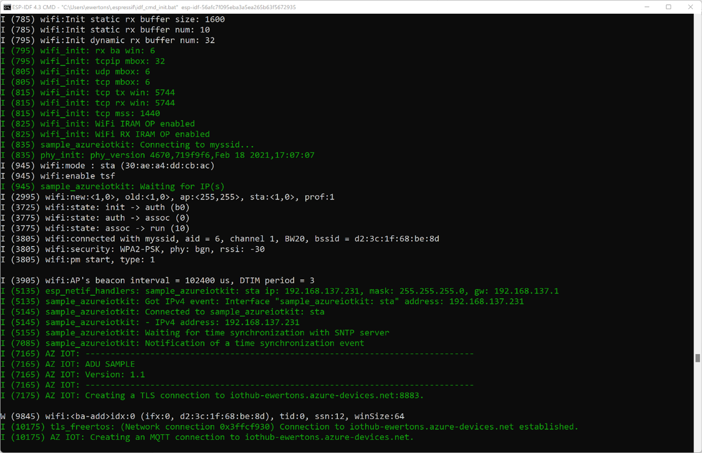

# Perform an Over the Air Update with the ESP32

This sample will allow you to update an ESP32 over the air (OTA) using Azure Device Update. The following is an outline of the steps to run this sample.

- [Prepare the Device](#prepare-the-device)
  - [Install Prerequisites](#install-prerequisites)
  - [Tag Your Device](#tag-your-device)
  - [Prepare the Sample](#prepare-the-sample)
  - [Build the Image](#build-the-image)
  - [Flash the Image](#flash-the-image)
- [Prepare the ADU Service](#prepare-the-adu-service)
- [Deploy the Over the Air Update](#deploy-the-over-the-air-update)
  - [Build the Update Image](#build-the-update-image)
  - [Generate the ADU Update Manifest](#generate-the-adu-update-manifest)
  - [Import the Update Manifest](#import-the-update-manifest)
  - [Deploy Update](#deploy-update)

**Note** that this sample does not utilize non-volatile storage of device credentials. That means that the update image contains the credentials themselves and each update may only apply to one device. For information on how to store credentials in non-volatile storage, please see the following link:

- [ESP32 NVS API Documentation](https://docs.espressif.com/projects/esp-idf/en/latest/esp32/api-reference/storage/nvs_flash.html)
- [ESP32 NVS Factory Flashing Tool](https://github.com/espressif/esp-idf/tree/master/tools/mass_mfg)

## Prepare the Device

### Install Prerequisites

1. Git

    Install `git` following the [official website](https://git-scm.com/).

1. ESP-IDF

    On Windows, install the ESPRESSIF ESP-IDF using this [download link](https://dl.espressif.com/dl/esp-idf). This guide was tested against [ESP-IDF v4.4.3](https://github.com/espressif/esp-idf/tree/v4.4.3).

    For other Operating Systems or to update an existing installation, follow [Espressif official documentation](https://docs.espressif.com/projects/esp-idf/en/latest/esp32/get-started/index.html#get-started).

1. [Powershell](https://docs.microsoft.com/powershell/scripting/install/installing-powershell?view=powershell-7.2)

1. Azure CLI and Azure IoT Module

    See steps to install both [here](https://learn.microsoft.com/azure/iot-hub-device-update/create-update?source=recommendations#prerequisites).

1. Azure IoT Embedded middleware for FreeRTOS

Clone this repo to download all sample device code, setup scripts, and offline versions of the documentation.

**If you previously cloned this repo in another sample, you don't need to do it again.**

```bash
git clone https://github.com/Azure-Samples/iot-middleware-freertos-samples.git
```

To initialize the repo, run the following commands:

```bash
cd iot-middleware-freertos-samples
git submodule update --init --recursive
```

You may also need to enable long path support for both Microsoft Windows and git:

- [Windows long path support](https://docs.microsoft.com/windows/win32/fileio/maximum-file-path-limitation?tabs=cmd#enable-long-paths-in-windows-10-version-1607-and-later>)
- Git: as Administrator run `git config --system core.longpaths true`

### Tag Your Device

Add the `"ADUGroup"` tag to the device's top-level twin document. This is used to group device together, and you may choose whichever title you prefer.

```json
"tags": {
    "ADUGroup": "<your-tag-here>"
},
```

Viewing the device twin on the portal, the "tag" section should look similar to the following. Don't worry if you do or do not have a `"deviceUpdate"` section in the `"ADUGroup"` tag. ADU adds that as a default group.


### Prepare the Sample

To connect the ESPRESSIF ESP32 to Azure, you will update the sample configuration, build the image, and flash the image to the device.

The configuration of the ESPRESSIF ESP32 sample uses the ESP-IDF samples standard [kconfig](https://docs.espressif.com/projects/esp-idf/en/latest/esp32/api-reference/kconfig.html) configuration.

On a [console with ESP-IDF](https://docs.espressif.com/projects/esp-idf/en/latest/esp32/get-started/index.html#step-4-set-up-the-environment-variables), navigate to the ESP ADU project directory: `demos\projects\ESPRESSIF\adu` and run the following commands:

Set the environment variable to avoid long-path build issues:

```bash
set IDF_CCACHE_ENABLE=0
```

Run the configuration menu for the device:

```bash
idf.py menuconfig
```

Under menu item `Azure IoT middleware for FreeRTOS Sample Configuration`, update the following configuration values:

Parameter | Value
---------|----------
 `WiFi SSID` | _{Your WiFi SSID}_
 `WiFi Password` | _{Your WiFi password}_

**NOTE** that the ESP32 MCU works with 2.4 GHz WiFi only. You can create a custom 2.4 GHz hotspot from your Windows machine if you do not want to use your own WiFi network. If you have an iPhone, you can also create a hotspot and turn on the “Maximize Compatibility” setting. For Android, the setting should be called "Extend Compatibility".

Under menu item `Azure IoT middleware for FreeRTOS Main Task Configuration`, update the following configuration values:

Parameter | Value
---------|----------
 `Azure IoT Hub FQDN` | _{Your Azure IoT Hub Host FQDN}_
 `Azure IoT Device ID` | _{Your Azure IoT Hub device ID}_
 `Azure IoT Device Symmetric Key` | _{Your Azure IoT Hub device symmetric key}_
 `Azure IoT Module ID` | _{Your Azure IoT Hub Module ID}_ (IF USING A MODULE; leave blank if not)

> Some parameters contain default values that do not need to be updated.

If you're using **DPS** with an individual enrollment with SAS authentication, set the following parameters:

Parameter | Value
---------|----------
 `Enable Device Provisioning Sample` | _{Check this option to enable DPS in the sample}_
 `Azure Device Provisioning Service ID Scope` | _{Your ID scope value}_
 `Azure Device Provisioning Service Registration ID` | _{Your Device Registration ID value}_

> Some parameters contain default values that do not need to be updated.

Save the configuration (`Shift + S`) inside the sample folder in a file with name `sdkconfig`.
After that, close the configuration utility (`Shift + Q`).

### Build the Image

To build the device image, run the following command (the path `"C:\espbuild"` is only a suggestion, feel free to use a different one, as long as it is near your root directory, for a shorter path):

  ```bash
  idf.py --no-ccache -B "C:\espbuild" build
  ```

### Flash the Image

1. Connect the Micro USB cable to the Micro USB port on the ESPRESSIF ESP32 board, and then connect it to your computer.

2. Find the COM port mapped for the device on your system.

    On **Windows**, go to `Device Manager`, `Ports (COM & LTP)`. Look for a "CP210x"-based device and take note of the COM port mapped for your device (e.g. "COM5").

    On **Linux**, save and run the following script:

    ```shell
    #!/bin/bash
    # Copyright (c) Microsoft Corporation.
    # Licensed under the MIT License. */

    # Lists all USB devices and their paths

    for sysdevpath in $(find /sys/bus/usb/devices/usb*/ -name dev); do
        (
            syspath="${sysdevpath%/dev}"
            devname="$(udevadm info -q name -p $syspath)"
            [[ "$devname" == "bus/"* ]] && exit
            eval "$(udevadm info -q property --export -p $syspath)"
            [[ -z "$ID_SERIAL" ]] && exit
            echo "/dev/$devname - $ID_SERIAL"
        )
    done
    ```

    Considering the script was saved as `list-usb-devices.sh`, run:

    ```bash
    chmod 777 ./list-usb-devices.sh
    ./list-usb-devices.sh
    ```

    Look for a "CP2102"-based entry and take note of the path mapped for your device (e.g. "/dev/ttyUSB0").

3. Run the following command:

    > This step assumes you are in the ESPRESSIF ESP32 sample directory (same as configuration step above).

    ```bash
    idf.py --no-ccache -B "C:\espbuild" -p <COM port> flash    
    ```

    <details>
    <summary>Example...</summary>

    On **Windows**:

    ```shell
    idf.py --no-ccache -B "C:\espbuild" -p COM5 flash
    ```

    On **Linux**:

    ```shell
    idf.py -p /dev/ttyUSB0 flash
    ```
    </details>

At some point after the device connects to Azure IoT Hub, look for this splash message:

```log
I (7165) AZ IOT: ------------------------------------------------------------------------------
I (7165) AZ IOT: ADU SAMPLE
I (7165) AZ IOT: Version: 1.0
I (7165) AZ IOT: ------------------------------------------------------------------------------
```

Note the `Version: 1.0` listed.

## Prepare the ADU Service

To create an Azure Device Update instance and connect it to your IoT Hub, please follow the directions linked here:

- [Create an Azure Device Update Instance](https://docs.microsoft.com/azure/iot-hub-device-update/create-device-update-account?tabs=portal)

For other prerequisite help, please see the links below. If none of the links apply to your development environment, you may skip them.

- [Create an Azure IoT Hub](https://docs.microsoft.com/azure/iot-hub/iot-hub-create-through-portal)
  > Important: To use Azure Device Update you must have an Azure IoT Hub with [scale unit](https://learn.microsoft.com/azure/iot-hub/iot-hub-scaling) S1, S2, S3 or a free/standard hub. This sample will not work with a Basic Azure IoT Hub scale unit.
- [Create Device Provisioning Service Instance](https://docs.microsoft.com/azure/iot-dps/quick-setup-auto-provision)

## Deploy the Over the Air Update

### Build the Update Image

Open a new instance of the ESP-IDF console and navigate to the adu sample directory.

Modify the version of the image as below:

On file `iot-middleware-freertos-samples\demos\projects\ESPRESSIF\adu\config\demo_config.h` ([found here](https://github.com/Azure-Samples/iot-middleware-freertos-samples/blob/de7d6493cdac5f946cf966a9cabc2411a9bfaa29/demos/projects/ESPRESSIF/adu/config/demo_config.h#L495))

Change

```c
#define democonfigADU_UPDATE_VERSION      "1.0"
```

to

```c
#define democonfigADU_UPDATE_VERSION      "1.1"
```

The resulting binary `azure_iot_freertos_esp32.bin` should be located in the build directory which is detailed in the build instructions from the link above (our example was `C:\espbuild`). Save it into `C:\ADU-update`, renaming it to `azure_iot_freertos_esp32-v1.1.bin`.

### Generate the ADU Update Manifest

Open PowerShell.

Navigate to `C:\ADU-update` directory.

Run the following command:

```powershell
az iot du update init v5 --update-provider Contoso --update-name ESP32-Azure-IoT-Kit --update-version 1.1 --compat deviceModel=ESP32-Azure-IoT-Kit deviceManufacturer=ESPRESSIF --step handler=microsoft/swupdate:1 properties='{\"installedCriteria\":\"1.1\"}' --file path=./azure_iot_freertos_esp32-v1.1.bin > ./Contoso.ESP32-Azure-IoT-Kit.1.1.importmanifest.json
```

Verify you have the following files in your ADU-update directory:

- `azure_iot_freertos_esp32-v1.1.bin`
- `Contoso.ESP32-Azure-IoT-Kit.1.1.importmanifest.json`

### Import the Update Manifest

To import the update (`azure_iot_freertos_esp32-v1.1.bin`) and manifest (`Contoso.ESP32-Azure-IoT-Kit.1.1.importmanifest.json`), follow the instructions at the link below:

- [Import Update and Manifest](https://docs.microsoft.com/azure/iot-hub-device-update/import-update)

### Deploy Update

To deploy the update to your ESP32, follow the link below:

- [Deploy Update](https://docs.microsoft.com/azure/iot-hub-device-update/deploy-update)

After you deploy the update, the device should receive the new writable properties payload (i.e., the ADU service “request”) and start processing it.

Once the device reboots, you should see on the console, output that looks like the following:



Note the section which states `Version 1.1`. Congratulations! Your ESP32 is now running new, updated software!

## Size Chart

The following chart shows the RAM and ROM usage for the ESPRESSIF ESP32 microcontroller.

- Build options: Compile optimized for size (-Os) and no logging (-DLIBRARY_LOG_LEVEL=LOG_NONE).
- Commands used: `idf.py size` and `idf.py size-components`

This sample can include either IoT Hub only or both IoT Hub and DPS services. The table below shows RAM/ROM sizes considering:

- Middleware libraries only – represents the libraries for Azure IoT connection and features.
- Total size – which includes the Azure IoT middleware for FreeRTOS, Mbed TLS, FreeRTOS, CoreMQTT and the HAL for the dev kit.

|  | Middleware library size | | Total Size | |
|---------|----------|---------|---------|---------
| **Sample** | **Flash (code,rodata)** | **DRAM,IRAM (bss,data)** | **Flash (code,rodata)** | **DRAM,IRAM (bss,data)** |
| IoT Hub + DPS + ADU | 51.49 KB | 112 bytes | 715.51 KB | 55.22 KB
| IoT Hub + ADU | 40.24 KB | 112 bytes | 703.18 KB | 48.34 KB
| IoT Hub only | 28.73 KB | 12 bytes | 694.65 KB | 118.34 KB
