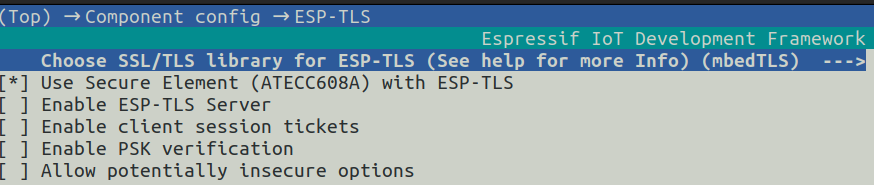
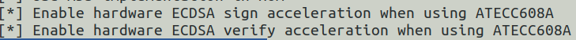
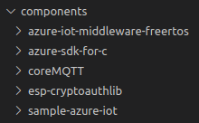

# Support for Microchip ATECC608 Secure Element For ESP32 Plaforms

## Pre-conditions

- Ensure that the project is clean. Use `rm -rf build/` to ensure a clean slate.
- Ensure that you are using the default sdkconfig. Use `rm sdkconfig` just to be sure.
- Ensure internet connectivity to enable successful download of `esp-cryptoauthlib` component

## Steps to add Microchip ATECC608 Secure Element support

Perform the below steps **before doing any application level configuration like Wi-Fi settings, Azure Samples configuration, etc.**

### Step 1 - Kconfig configuration

- Open kconfig menu using `idf.py menuconfig`
- Navigate: `Component Config` --> `ESP-TLS`
- Enable: `Use Secure Element (ATECC608A) with ESP-TLS`

- Navigate: `Component Config` --> `mbedTLS`
- Enable: `Enable hardware ECDSA Sign acceleration when using ATECC608A`
- Enable: `Enable hardware ECDSA Verify acceleration when using ATECC608A`

- Save configuration and exit

### Step 2 - Run menuconfig again

- Open kconfig menu again using `idf.py menuconfig` - observe the output, esp-cryptoauthlib should be downloaded this time since secure element support is now enabled.

- Exit the kconfig menu - we are ready to try a build now
- Observe that `esp-cryptoauthlib` is located inside `components/` folder and should be picked up by Ninja during the test build

### Step 3 - Try a build

- Try a build using `idf.py build` - observe the output, esp-cryptoauthlib should be built along with relevant mbedTLS support

**If build is successful**, you are now ready to make application level configurations like Wi-Fi settings, Azure Samples settings, ATECC608 pin settings, etc.

**If build fails**, ensure that above steps are followed correctly. Before re-attempting the process,
- delete the build directory using `rm -rf build/`
- delete the sdkconfig file by using `rm sdkconfig`.

## FAQ

**Q:** Why do I need to open the menuconfig a second time after enabling secure element support?

**A:** If this step is not done, although the esp-cryptoauthlib gets downloaded correctly during the build attempt, the build fails due to the way mbedTLS component is configured at build time. Running the menuconfig command immediately after enabling secure element support does the necessary linkages that can be picked up at the first build attempt.
 

**Q:** What is the right way to remove ATECC608 support?

**A:** To completely remove ATECC608 support, it is best to start with a clean slate to avoid any dependency issues. Ddelete the build folder (`rm -rf build/`), delete the sdkconfig (`rm sdkconfig`) and delete the esp-cryptoauthlib from components/ folder.
 