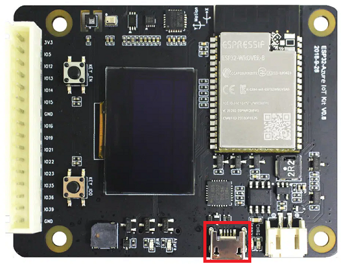
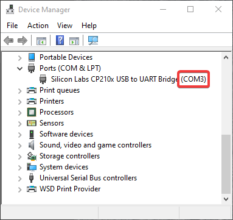
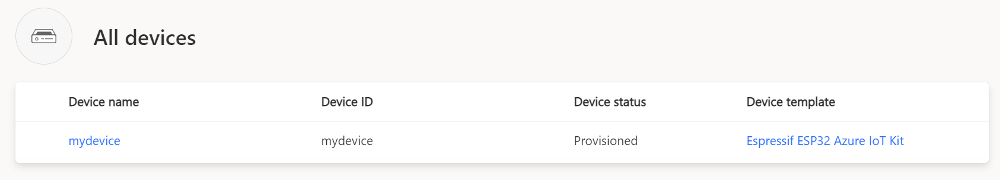
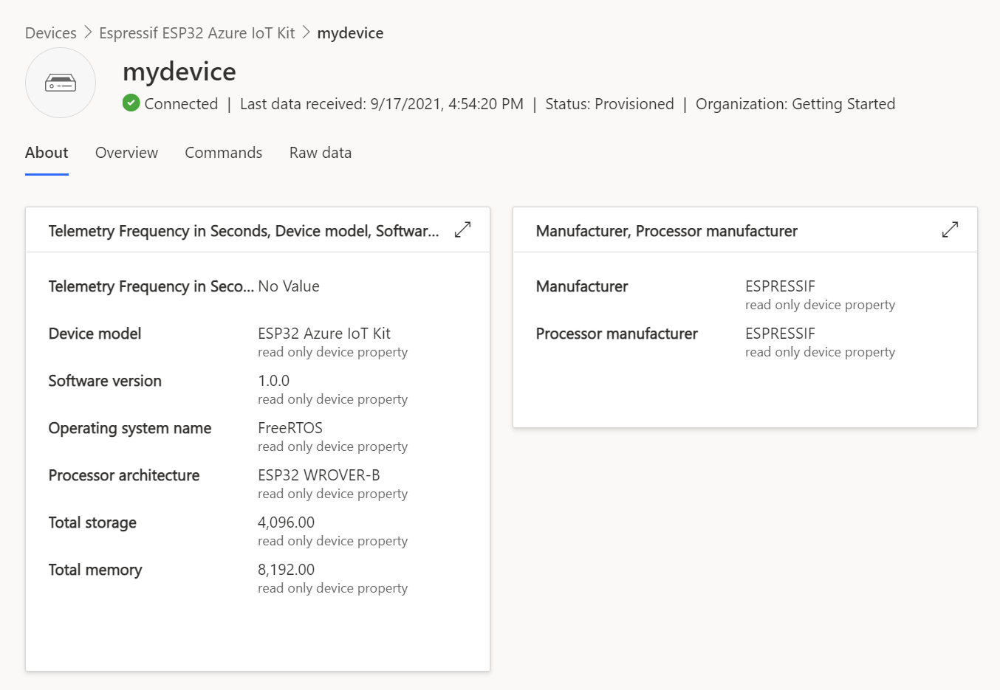

# Getting started with the ESPRESSIF ESP32-Azure IoT Kit

**Total completion time**:  30 minutes

In this tutorial you use the Azure FreeRTOS Middleware to connect the ESPRESSIF [ESP32-Azure IoT Kit](https://www.espressif.com/products/devkits/esp32-azure-kit/overview) (hereafter, the ESP32 DevKit) to Azure IoT. The article is part of the series [IoT Device Development](https://go.microsoft.com/fwlink/p/?linkid=2129824). The series introduces device developers to the Azure FreeRTOS Middleware, and shows how to connect several device evaluation kits to Azure IoT.

You will complete the following tasks:

* Install the embedded development tools
* Build the image and flash it onto the ESP32 DevKit
* Use Azure IoT Central to create cloud components, view properties, view device telemetry, and call direct commands

## Prerequisites

* An ESP-IDF supported Operating System:

    > * Windows (Recommended)
    > * Linux
    > * macOS

* Hardware

    > * ESPRESSIF [ESP32-Azure IoT Kit](https://www.espressif.com/products/devkits/esp32-azure-kit/overview)
    > * Wi-Fi 2.4 GHz
    > * USB 2.0 A male to Micro USB male data cable

## Prepare the development environment

To set up your development environment, first you install the ESPRESSIF ESP-IDF, and then you launch the ESP-IDF Powershell and clone the repository.

### Install the tools

This project is built using the ESP-IDF, which includes all the tools required to clone, build, flash and monitor your device.

For **Windows**:

1. Download and launch the [ESP-IDF Online installer](https://dl.espressif.com/dl/esp-idf).
1. When prompted for the version of ESP-IDF, choose the **latest release version**.
1. When prompted for components to be installed, choose **Full installation**.

For **Linux** or **macOS**:
    
1. Install the prerequisites by following the instructions at [ESP-IDF Get Started](https://docs.espressif.com/projects/esp-idf/en/latest/esp32/get-started).
1. Is is recommended to checkout a release version of the ESP-IDF, the master branch may contain blocking bugs. This guide was tested against [ESP-IDF v4.4.3](https://github.com/espressif/esp-idf/tree/v4.4.3).
    
    ```shell
    git checkout tags/v4.4.3
    ```

> **NOTE:** For advanced installations, or for more information relating to the ESP-IDF, please refer to the [ESP-IDF Programming Guide](https://docs.espressif.com/projects/esp-idf/en/latest/esp32).

## Create the cloud components

### Create the IoT Central Application

There are several ways to connect devices to Azure IoT. In this section, you learn how to connect a device by using Azure IoT Central. IoT Central is an IoT application platform that reduces the cost and complexity of creating and managing IoT solutions.

To create a new application:

1. From [Azure IoT Central portal](https://apps.azureiotcentral.com/), select **My apps** on the side navigation menu.
1. Select **+ New application**.
1. Select **Custom apps**.
1. Add Application Name and a URL.
1. Choose the pricing plan of your preference.

    

1. Select **Create**.
1. After IoT Central provisions the application, it redirects you automatically to the new application dashboard.

    > Note: If you have an existing IoT Central application, you can use it to complete the steps in this article rather than create a new application.

### Create a new device

In this section, you use the IoT Central application dashboard to create a new device. You will use the connection information for the newly created device to securely connect your physical device in a later section.

To create a device:

1. From the application dashboard, select **Devices** on the side navigation menu.
1. Select **+ New** to bring up the **Create a new device** window.
1. Leave Device template as **Unassigned**.
1. Fill in the desired Device name and Device ID.

    

1. Select the **Create** button.
1. The newly created device will appear in the **All devices** list.  Select on the device name to show details.
1. Select **Connect** in the top right menu bar to display the connection information used to configure the device in the next section.

    

1. Note the connection values for the following connection string parameters displayed in **Connect** dialog. You'll use these values during the following configuration step:

> * `ID scope`
> * `Device ID`
> * `Primary key`

## Prepare the device

To connect the ESP32 DevKit to Azure, you'll modify a configuration file for Wi-Fi and Azure IoT settings, rebuild the image, and flash the image to the device.

### Launch the ESP-IDF Powershell

From this point, all commands are launched from with the ESP-IDF command line. To launch the command line:

1. From the Windows Start menu, launch the *ESP-IDF 4.4 PowerShell*.

### Clone the repo for the tutorial

Clone the following repo to download all sample device code. If you previously cloned this repo in another tutorial, you don't need to do it again.

Using the ESP-IDF Powershell:

1. Navigate to a directory where you wish to clone the repo.

1. Clone the repo with the following command:

    ```shell
    git clone --recursive https://github.com/Azure-Samples/iot-middleware-freertos-samples
    ```

### Add configuration

Using the ESP-IDF Powershell:

1. Navigate to the *iot-middleware-freertos-samples* directory that was cloned in the previous steps.
1. Navigate to the ESP-Azure IoT Kit project directory: *demos\projects\ESPRESSIF\aziotkit*
1. Execute the following command to launch the configurator:

    ```shell
    idf.py menuconfig
    ```

Add **Azure IoT Central** configuration:

1. Select *Azure IoT middleware for FreeRTOS Main Task Configuration  --->*
1. Enable *Enable Device Provisioning Sample*
1. Set the following parameters, using the connection information saved after you created Azure resources.

    Parameter | Value
    ---------|----------
     `Azure IoT Device Symmetric Key` | {Your Primary key value}
     `Azure Device Provisioning Service ID Scope` | {Your ID scope value}
     `Azure Device Provisioning Service Registration ID` | {Your Device ID value}

1. Press **ESC** to return to the previous menu

Add **Wi-Fi** configuration:

1. Select *Azure IoT middleware for FreeRTOS Sample Configuration  --->*
1. Set the following parameters using your local Wi-Fi credentials.

    Parameter | Value
    ---------|----------
     `WiFi SSID` | _{Your WiFi SSID}_
     `WiFi Password` | _{Your WiFi password}_

1. Press **ESC** to return to the previous menu

Save configuration:

1. Press **S** and then press **Enter** so save the configuration, and **Enter** to dismiss the acknowledgment
1. Press **Q** to quit the configuration tool

### Build the image

In your console, run the following commands from the *iot-middleware-freertos-samples\demos\projects\ESPRESSIF\aziotkit* directory to build the device image:

```shell
idf.py --no-ccache -B "C:\espbuild" build
```

After the build completes, you can confirm that the binary file was created with the following path:

> *iot-middleware-freertos-samples\demos\projects\ESPRESSIF\aziotkit\build\azure_iot_freertos_esp32.bin*

### Flash the image

1. On the ESP32 DevKit, locate the Micro USB port as highlight in the image below.

    

1. Connect the Micro USB cable to the Micro USB port on the ESP32 DevKit, and then connect it to your computer.

1. Within the **Windows Device Manager**, locate the Com Port associated with the ESP32 DevKit as shown in the image below.

    

1. From the ESP-IDF Powershell, execute the following command, substituting the correct COM Port from the previous step  (e.g. **COM3**):

    ```shell
    idf.py --no-ccache -B "C:\espbuild" -p <COM port> flash
    
    ```
    The path `"C:\espbuild"` above is only a suggestion, feel free to use a different one, as long as it is near your root directory, for a shorter path.

1. Check the output completes with the following text for a successful flash:

    ```output
    Hash of data verified
    
    Leaving...
    Hard resetting via RTS pin...
    Done
    ```

### Confirm device connection details

You can use the ESP-IDF monitor tool to observe communication and confirm that your device is set up correctly.

1. From the ESP-IDF Powershell, start the monitoring tool, substituting the correct COM Port:

    ```shell
    idf.py -B "C:\espbuild" -p <COM port> monitor
    ```

1. Check for the following output to confirm that the device is initialized and connected to Azure IoT.

    ```output
    I (32881) AZ IOT: Keeping Connection Idle...
    I (35021) AZ IOT: Successfully sent telemetry message
    I (35021) AZ IOT: Attempt to receive publish message from IoT Hub.
    ```

## Verify the device status

To view the device status in IoT Central portal:

1. From the application dashboard, select **Devices** on the side navigation menu.
1. Check the **Device status** of the device is updated to **Provisioned**.
1. Check the **Device template** of the device has updated to **Espressif ESP32 Azure IoT Kit**.

    

## View telemetry

With IoT Central, you can view the flow of telemetry from your device to the cloud.

To view telemetry in IoT Central portal:

1. From the application dashboard, select **Devices** on the side navigation menu.
1. Select the device from the device list.
1. View the telemetry as the device sends messages to the cloud in the **Overview** tab.

    

## Send a command on the device

You can also use IoT Central to send a command to your device. In this section, you can call a command to toggle LEDs or write to the screen.

To write to the screen:

1. Select the **Command** tab from the device page.
1. Locate the **Display Text** command.
1. In the **Content** textbox, enter the text to be displayed on the screen.
1. Select **Run**. 
1. The screen on the device will update with the desired text.

To toggle an LED:

1. Select the **Command** tab from the device page.
1. Locate the **Toggle LED 1** or **Toggle LED 2** command
1. Select **Run**.
1. An LED light on the device will toggle state.


## View device information

You can view the device information from IoT Central.

Select **About** tab from the device page.


## Clean up resources

If you no longer need the Azure resources created in this tutorial, you can delete them from the IoT Central portal. Optionally, if you continue to another tutorial in this Getting Started guide, you can keep the resources you've already created and reuse them.

To keep the Azure IoT Central sample application but remove only specific devices:

1. Select the **Devices** tab for your application.
1. Select the device from the device list.
1. Select **Delete**.

To remove the entire Azure IoT Central sample application and all its devices and resources:

1. Select **Administration** > **Your application**.
1. Select **Delete**.

## Next Steps

In this tutorial you built a custom image that contains the Azure FreeRTOS middleware sample code, and then flashed the image to the ESP32 DevKit device. You also used the IoT Central portal to create Azure resources, connect the ESP32 DevKit securely to Azure, view telemetry, and send messages.
