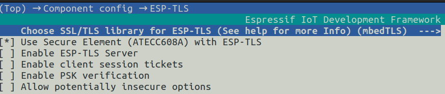
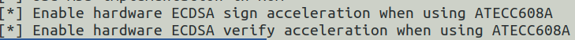
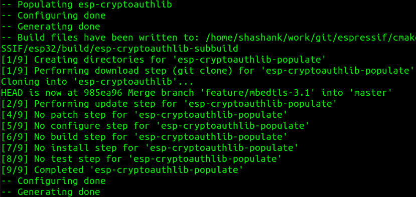
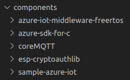

# Support for Microchip ATECC608 Secure Element For ESP32 Platforms

## Pre-conditions

- Ensure that the project is clean. Use `rm -rf build/` to ensure a clean slate.
- Ensure that you are using the default sdkconfig. Use `rm sdkconfig` just to be sure.
- Ensure internet connectivity to enable successful download of `esp-cryptoauthlib` component.

## Steps to prepare the ESP32 and Microchip ATECC608 Hardware

### Hardware connection between the ESP32 and Microchip ATECC608

We have tested the following hardware combinations:

- ESP32 hardware:
  - ESP32-WROVER-B (ESP32 Azure IoT Kit) 
  - ESP32-WROVER-E (ESP32-WROVER-KIT) - _note: we were unable to program the ATECC608B certificates with this board_

- Microchip ATECC608 hardware:
  - Microchip DT100104 ATECC608 DevKit in the Trust&Go configuration only.

The following connections are recommended for any of the boards mentioned above:

| ESP32 | ATECC608 |
|-------|----------|
| 3V3   | VCC      |
| GND   | GND      |
| IO21  | SDA      |
| IO22  | SCL      |

### Generate ATECC608 Certificates

This step uses the ATECC608 HSM's key-pair and serial number to generate an X.509 device certificate. One way to derive a certificate is by using the ESP32 board as an ATECC608 programmer using the [ESP-CryptoAuth-Utility](https://github.com/espressif/esp-cryptoauthlib/tree/master/esp_cryptoauth_utility#readme).

The tool will generate an X509 certificate chain. You can choose between using Azure IoT Device Provisioning Group Enrollments by using your own certification authority, or an Individual Enrollment by using the (device) leaf certificate and configuring the DPS `registrationID` as the ATECC608's serial number (e.g. `sn0123ABCDE000000001`).

E.g. : `python secure_cert_mfg.py --port COM6 --i2c-sda-pin 21 --i2c-scl-pin 22`

## Steps to add Microchip ATECC608 Secure Element support

Perform the below steps **before doing any application-level configuration like Wi-Fi settings, Azure Samples configuration, etc.**

### Step 1 - Kconfig configuration

- Open kconfig menu using `idf.py menuconfig`
- Navigate: `Component Config` --> `ESP-TLS`
- Enable: `Use Secure Element (ATECC608A) with ESP-TLS`

- Navigate: `Component Config` --> `mbedTLS`
- Enable: `Enable hardware ECDSA Sign acceleration when using ATECC608A`
- Enable: `Enable hardware ECDSA Verify acceleration when using ATECC608A`

- Save configuration and exit

### Step 2 - Run menuconfig again

- Open kconfig menu again using `idf.py menuconfig` - observe the output, esp-cryptoauthlib should be downloaded this time since secure element support is now enabled.

- Exit the kconfig menu - we are ready to try a build now
- Observe that `esp-cryptoauthlib` is located inside `components/` folder and should be picked up by Ninja during the test build

### Step 3 - Try a build

- Try a build using `idf.py build` - observe the output, esp-cryptoauthlib should be built along with relevant mbedTLS support

**If build is successful**, you are now ready to make application-level configurations like Wi-Fi settings, Azure Samples settings, ATECC608 pin settings, etc.

**If build fails**, ensure that above steps are followed correctly. Before re-attempting the process,

- delete the build directory using `rm -rf build/`
- delete the sdkconfig file by using `rm sdkconfig`.

### Step 4 - Configure ATECC in Kconfig

- Navigate: `Component Config` --> `esp-cryptoauthlib`
  - Configure `SDA` and `SCL` to the correct I/O pins (e.g. `SDA=21` and `SCL=22`).
  - Configure the ATECC type to either `Trust&Go`, `TrustFLEX` or `TrustCUSTOM`.
  - Configure the I2C Address based on the ATECC type selected:

    | ATECC Type                  | I2C Address |
    |-----------------------------|-------------|
    |ATECC608-TNGTLS (Trust&Go)   | 0x6A        |
    |ATECC608-TFLXTLS (TrustFLEX) | 0x6C        |
    |ATECC608-TNGTLS (TrustCUSTOM)| 0xC0        |

- Navigate: `Azure IoT middleware` and configure:
  - WiFi Credentials
  - `Authentication Method = X509 Certificates`
  - `Client Certificate` = paste ATECC PEM certificate
  - `Client Key` = leave blank
  - Enable: `Device Provisioning Sample`
  - `ID Scope`
  - `Registration ID` = leave blank. The sample will use the ATECC serial number (must be the same as the `Client Certificate`'s Subject CN field). 

## FAQ

**Q:** Why do I need to open the menuconfig a second time after enabling secure element support?

**A:** If this step is not done, although the esp-cryptoauthlib gets downloaded correctly during the build attempt, the build fails due to the way mbedTLS component is configured at build time. Running the menuconfig command immediately after enabling secure element support does the necessary linkages that can be picked up at the first build attempt.

**Q:** What is the right way to remove ATECC608 support?

**A:** To completely remove ATECC608 support, it is best to start with a clean slate to avoid any dependency issues. Delete the build folder (`rm -rf build/`), delete the sdkconfig (`rm sdkconfig`) and delete the esp-cryptoauthlib from components/ folder.
