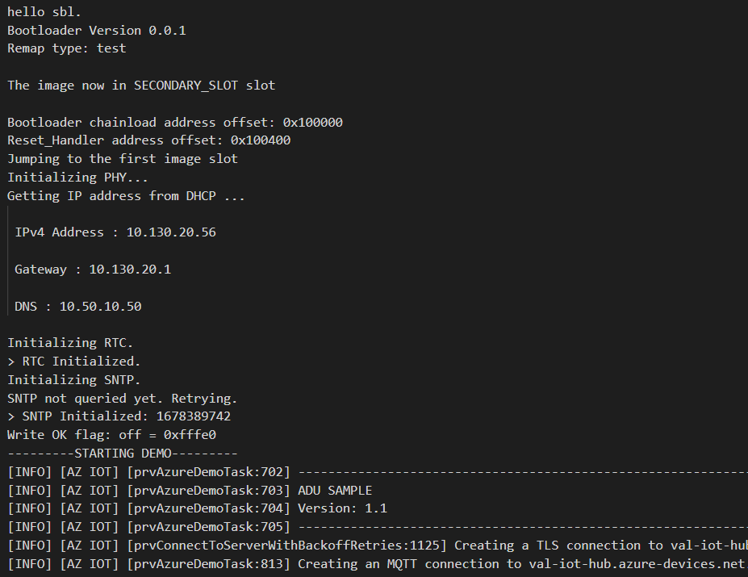

# Perform an Over the Air Update with the NXP MIMXRT1060-EVK Evaluation kit

This sample will allow you to update an NXP MIMXRT1060-EVK Evaluation kit over the air (OTA) using Azure Device Update. The following is an outline of the steps to run this sample.

- [Prepare the Device](#prepare-the-device)
  - [Install Prerequisites](#install-prerequisites)
  - [Tag Your Device](#tag-your-device)
  - [Prepare the Bootloader](#prepare-the-bootloader)
  - [Flash the Bootloader](#flash-the-bootloader)
  - [Confirm Device Bootloader Details](#confirm-device-bootloader-details)
  - [Prepare the Sample](#prepare-the-sample)
  - [Build the Image](#build-the-image)
  - [Flash the Image](#flash-the-image)
  - [Confirm Device Connection Details](#confirm-device-connection-details)
- [Prepare the ADU Service](#prepare-the-adu-service)
- [Deploy the Over the Air Update](#deploy-the-over-the-air-update)
  - [Build the Update Image](#build-the-update-image)
  - [Generate the ADU Update Manifest](#generate-the-adu-update-manifest)
  - [Import the Update Manifest](#import-the-update-manifest)
  - [Deploy Update](#deploy-update)
- [Tips and Tricks](#tips-and-tricks)

## Prepare the Device

### Install Prerequisites

1. Git

    Install `git` following the [official website](https://git-scm.com/).
1. [Powershell](https://docs.microsoft.com/powershell/scripting/install/installing-powershell?view=powershell-7.2)

1. Azure CLI and Azure IoT Module

    See steps to install both [here](https://learn.microsoft.com/azure/iot-hub-device-update/create-update?source=recommendations#prerequisites).

1. [CMake](https://cmake.org/download/) (Version 3.13 or higher)
1. [Ninja build system](https://github.com/ninja-build/ninja/releases) (Version 1.10 or higher)
1. [GNU arm-none-eabi Embedded Toolchain](https://developer.arm.com/tools-and-software/open-source-software/developer-tools/gnu-toolchain/gnu-rm/downloads) (This sample was tested against Version 10.3)
1. Serial terminal tool like [Termite](https://www.compuphase.com/software_termite.htm), Putty, Tera Term, etc.
1. A way to load the image to the device, such as [VS Code](VSCodeDebug.md), the [MCUXpresso IDE](LoadADUApplication.md#using-mcuxpresso-ide), or JLink/openocd on the [command line](LoadADUApplication.md#using-command-line).

To run this sample you can use a device previously created on your Azure IoT Hub or you may have the Azure IoT middleware for FreeRTOS provision your device automatically using Azure Device Provisioning Services (DPS). **Note** that even when using DPS, you still need an IoT Hub created and connected to DPS.

IoT Hub | DPS
---------|----------
Have an [Azure IoT Hub](https://docs.microsoft.com/azure/iot-hub/iot-hub-create-through-portal) created | Have an instance of [IoT Hub Device Provisioning Service](https://docs.microsoft.com/azure/iot-dps/quick-setup-auto-provision#create-a-new-iot-hub-device-provisioning-service)
Have a [logical device](https://docs.microsoft.com/azure/iot-hub/iot-hub-create-through-portal#register-a-new-device-in-the-iot-hub) created in your Azure IoT Hub using your preferred authentication method* | Have an [individual enrollment](https://docs.microsoft.com/azure/iot-dps/how-to-manage-enrollments#create-a-device-enrollment) created in your instance of DPS using your preferred authentication method*

*While this sample supports SAS keys and Certificates, this guide will refer only to SAS keys.

Ensure that cmake, ninja and the ARM toolset binaries are available in the `PATH` environment variable.

You may also need to enable long path support for both Microsoft Windows and git:

- Windows: <https://docs.microsoft.com/windows/win32/fileio/maximum-file-path-limitation?tabs=cmd#enable-long-paths-in-windows-10-version-1607-and-later>
- Git: As **administrator** run

  ```powershell
  git config --system core.longpaths true
  ```

Clone this repo to download all sample device code, setup scripts, and offline versions of the documentation.

**If you previously cloned this repo in another sample, you don't need to do it again.**

```bash
git clone https://github.com/Azure-Samples/iot-middleware-freertos-samples.git
```

To initialize the repo, run the following commands:

```bash
cd iot-middleware-freertos-samples
git submodule update --init --recursive
```

### Tag Your Device

Add the `"ADUGroup"` tag to the device's top-level twin document. This is used to group devices together, and you may choose whichever title you prefer.

```json
"tags": {
    "ADUGroup": "<your-tag-here>"
},
```

Viewing the device twin on the portal, the "tag" section should look similar to the following. Don't worry if you do or do not have a `"deviceUpdate"` section in the `"ADUGroup"` tag. ADU adds that as a default group.


### Prepare the Bootloader

1. Clone the Secure Bootloader (sbl) repo. This guide has been tested with version 1.1.0.

    ```bash
    git clone https://github.com/nxp-mcuxpresso/sbl.git
    ```

1. Navigate to the folder: `sbl/target/evkmimxrt1060`.
1. Open `sblprofile.py` and change the `EXEC_PATH` to your gcc toolchain install path. Example:

    ```python
    # cross_tool provides the cross compiler
    # EXEC_PATH is the compiler execute path
    if  CROSS_TOOL == 'gcc':
        PLATFORM    = 'gcc'
        EXEC_PATH   = r'C:\Program Files (x86)\GNU Arm Embedded Toolchain\10 2021.10\bin'
    ```

1. Double-click the batch file `env.bat` to run it.
1. Run `scons --menuconfig` to configure the project.
    1. Enter submenu `MCU SBL Component` -> `secure`
    1. Type `N` to uncheck `Select image security function`
    1. Save the configuration and Exit.
1. Run `scons` to build the bootloader image.
1. Confirm that the file `sbl/target/evkmimxrt1060/build/sbl.bin` now exists and copy it.

### Flash the Bootloader

1. Connect the Micro USB cable to the Micro USB port on the NXP EVK, and then connect it to your computer. After the device powers up, a solid green LED shows the power status.

1. Use the Ethernet cable to connect the NXP EVK to an Ethernet port.

1. In File Explorer, find the  NXP EVK device that's connected to your computer. The device appears as a drive on your system with the drive label `RT1060-EVK`.

1. Paste the bootloader binary file `sbl.bin` (created and copied in the previous section) into the root folder of the NXP EVK. Flashing starts automatically and completes in a few seconds.

1. Reset the device once flashing completes.

### Confirm Device Bootloader Details

You can use one of the terminal applications to monitor communication and confirm that your device is set up correctly. Go to Device Manager in Windows to determine which COM port your device was assigned.

The following settings can be used to monitor serial data:

- Baud Rate: `115200`
- Data Bits: `8`
- Stop Bits: `1`
- Parity: none
- Flow Control: none

You should see that the output says it does not have a bootable image yet.

```log
hello sbl.
Bootloader Version 1.1.0
Remap type: none

The image now in PRIMARY_SLOT slot

bad image magic 0xffffffff

Unable to find bootable image
```

### Prepare the Sample

To connect the MIMXRT1060-EVK to Azure, you'll modify a configuration file for Azure IoT settings, rebuild the image, and flash the image to the device.

Update the file `./demos/projects/NXP/mimxrt1060/config/demo_config.h` with your configuration values.

If you're using a device previously created in your **IoT Hub** with SAS authentication, disable DPS by commenting out `#define democonfigENABLE_DPS_SAMPLE` and set the following parameters:

Parameter | Value
---------|----------
 `democonfigDEVICE_ID` | _{Your Device ID value}_
 `democonfigHOSTNAME` | _{Your Azure IoT Hub Host name value}_
 `democonfigDEVICE_SYMMETRIC_KEY` | _{Your Primary Key value}_

If you're using **DPS** with an individual enrollment with SAS authentication, set the following parameters:

Parameter | Value
---------|----------
 `democonfigID_SCOPE` | _{Your DPS ID scope value}_
 `democonfigREGISTRATION_ID` | _{Your Device Registration ID value}_
 `democonfigDEVICE_SYMMETRIC_KEY` | _{Your Primary Key value}_

### Build the Image

To build the device image, navigate to the `iot-middleware-freertos-samples` directory and run the following commands:

  ```bash
    cmake -G Ninja -DBOARD=mimxrt1060 -DVENDOR=NXP -Bmimxrt1060 .
    cmake --build mimxrt1060
  ```

After the build completes, confirm that a folder named `mimxrt1060/` was created and it contains a file named `demos/projects/NXP/mimxrt1060/iot-middleware-sample-adu.bin`.

### Flash the Image

Use your debugger (instructions for VS Code [here](VSCodeDebug.md), MCUXpresso [here](LoadADUApplication.md#using-mcuxpresso-ide), or JLink/openocd on the command line [here](LoadADUApplication.md#using-command-line)) to flash the ADU sample.

> Note: Copy and pasting the sample binary into the device folder in the File Explorer will overwrite the bootloader. The debugger properly writes required device values to boot from the sample binary (which the ADU agent in the sample does as well). Once the debugger has loaded the sample to the board, the board can be reset the sample can be run without using the debugger.

### Confirm Device Connection Details

At some point after the device connects to Azure IoT Hub, look for this splash message:

```log
[INFO] [AZ IOT] [prvAzureDemoTask:702] ------------------------------------------------------------------------------
[INFO] [AZ IOT] [prvAzureDemoTask:703] ADU SAMPLE
[INFO] [AZ IOT] [prvAzureDemoTask:704] Version: 1.0
[INFO] [AZ IOT] [prvAzureDemoTask:705] ------------------------------------------------------------------------------
```

Note the `Version: 1.0` listed.

## Prepare the ADU Service

To create an Azure Device Update instance and connect it to your IoT Hub, please follow the directions linked here:

- [Create an Azure Device Update Instance](https://docs.microsoft.com/azure/iot-hub-device-update/create-device-update-account?tabs=portal)

<details>
<summary>For other prerequisite help, please see these links. If none of the links apply to your development environment, you may skip them.</summary>

- [Create an Azure IoT Hub](https://docs.microsoft.com/azure/iot-hub/iot-hub-create-through-portal)
  > Important: To use Azure Device Update you must have an Azure IoT Hub with [scale unit](https://learn.microsoft.com/azure/iot-hub/iot-hub-scaling) S1, S2, S3 or a free/standard hub. This sample will not work with a Basic Azure IoT Hub scale unit.
- [Create Device Provisioning Service Instance](https://docs.microsoft.com/azure/iot-dps/quick-setup-auto-provision)

</details>

## Deploy the Over the Air Update

### Build the Update Image

Modify the version of the image as below:

On file `./demos/projects/NXP/mimxrt1060/config/demo_config.h` ([found here](https://github.com/Azure-Samples/iot-middleware-freertos-samples/blob/main/demos/projects/NXP/mimxrt1060/config/demo_config.h#L241))

Change

```c
#define democonfigADU_UPDATE_VERSION      "1.0"
```

to

```c
#define democonfigADU_UPDATE_VERSION      "1.1"
```

The resulting binary `iot-middleware-sample-adu.bin` should be located in the build directory in `mimxrt1060\demos\projects\NXP\mimxrt1060\`. Save it into `C:\ADU-update`, renaming it to `iot-middleware-sample-adu-v1.1.bin`.

### Generate the ADU Update Manifest

Open PowerShell.

Navigate to the `C:\ADU-update` directory.

Run the following command:

```powershell
az iot du update init v5 --update-provider Contoso --update-name MIMXRT1060 --update-version 1.1 --compat deviceModel=MIMXRT1060 deviceManufacturer=NXP --step handler=microsoft/swupdate:1 properties='{\"installedCriteria\":\"1.1\"}' --file path=./iot-middleware-sample-adu-v1.1.bin > ./Contoso.MIMXRT1060.1.1.importmanifest.json
```

Verify you have the following files in your ADU-update directory:

- `iot-middleware-sample-adu-v1.1.bin`
- `Contoso.MIMXRT1060.1.1.importmanifest.json`

### Import the Update Manifest

To import the update (`iot-middleware-sample-adu-v1.1.bin`) and manifest (`Contoso.MIMXRT1060.1.1.importmanifest.json`), follow the instructions at the link below:

- [Import Update and Manifest](https://docs.microsoft.com/azure/iot-hub-device-update/import-update)

### Deploy Update

To deploy the update to your MIMXRT1060, follow the link below:

- [Deploy Update](https://docs.microsoft.com/azure/iot-hub-device-update/deploy-update)

After you deploy the update, the device should receive the new writable properties payload (i.e., the ADU service “request”) and start processing it.

Once the device reboots, you should see on the console, output that looks like the following:



Note the section which states `Version: 1.1`. Congratulations! Your MIMXRT1060 is now running new, updated software!

## Tips and Tricks

- The [NXP MCU Boot Utility](https://github.com/JayHeng/NXP-MCUBootUtility) is very helpful for developing with the flash functionality. You can use it to read and write to flash memory. Note that to connect to the device, you'll need to set the dip switch S7 to 0001, disconnect any serial monitors you have monitoring the board, and then press the reset button before it will connect. After reading/writing, set the dip switch S7 back to 0010 and press the reset button.
- If you are booting from the Secondary Slot (such as if you've updated once through ADU) and use the debugger to download a new image, it will be downloaded to the Primary Slot, but the image in the Secondary Slot will still be executed. You can either use the NXP MCU Boot Utility to write the binary to the Secondary Slot (offset 0x200000 for a write address of 0x60200000), or re-flash the bootloader to set the device to boot from the Primary Slot and then use the debugger to download the image.
