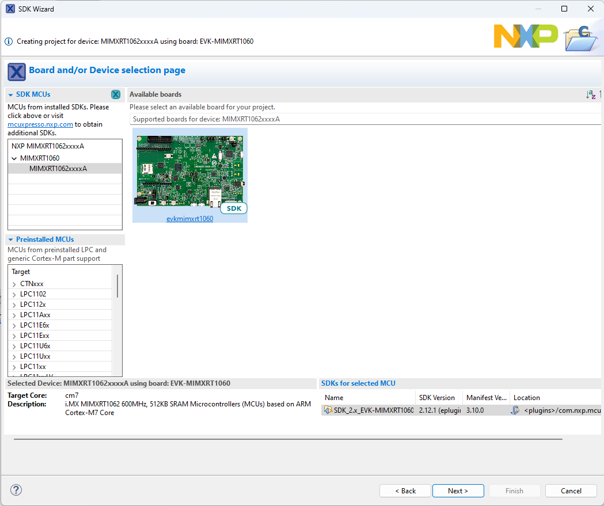
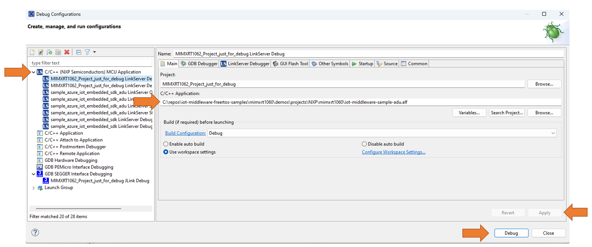

# Load an ADU Application to an NXP MIMXRT1060-EVK Evaluation kit using MCUXpresso IDE

## What you need

* Successfully build the ADU sample for the NXP Evaluation Kit DevKit: [MIMXRT1060-EVK](https://www.nxp.com/design/development-boards/i-mx-evaluation-and-development-boards/mimxrt1060-evk-i-mx-rt1060-evaluation-kit:MIMXRT1060-EVK).

* Make sure to run this git command before building and cloning:

 ```powershell
 # As **administrator** 
 git config --system core.longpaths true
```

* Have the bootloader flashed to the device (instructions [here](ADU.md#flash-the-bootloader)).

## Prerequisites

* Install the [MCUXpresso IDE](https://www.nxp.com/design/software/development-software/mcuxpresso-software-and-tools-/mcuxpresso-integrated-development-environment-ide:MCUXpresso-IDE).
* Download the build SDK for the EVK-MIMXRT1060 at [mcuxpresso.nxp.com](mcuxpresso.nxp.com)
    1. Select Development Board
    1. Filter by EVK-MIMXRT1060 and select this board
    1. Click `Build MCUXpresso SDK` (any version is fine)
    1. Select any configuration options and click `Download SDK`
    1. Click `Download SDK Archive including documentation`
    1. Open the location of the downloaded .zip file
    1. Open MCUXpresso IDE
    1. Click `Window` -> `Show View` -> `Installed SDKs`
    1. Drag and drop the downloaded .zip file in the `Installed SDKs` tab
* Create a new dummy MCUXpresso IDE project for the NXP MIMXRT1060-EVK Evaluation kit


## Setup the Debugger

* Right click on the project in the Project Explorer -> Debug As -> Debug Configurations.
* Add a new Launch Configuration under `C/C++ (NXP Semiconductors) MCU Application`.
* In the C/C++ Application field, find the ADU .elf file generated at `iot-middleware-freertos-samples/mimxrt1060/demo/projects/NXP/mimxrt1060/iot-middleware-sample-adu.elf`.
* Click Apply.
* Reopen the Debug Configurations and select the one you have just created.
* Click Debug.

* The image is now placed correctly on the device and you can stop the debugger, reset the board, and have the application running as normal.
