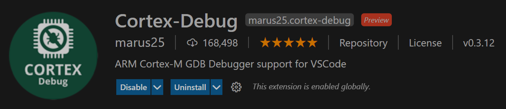
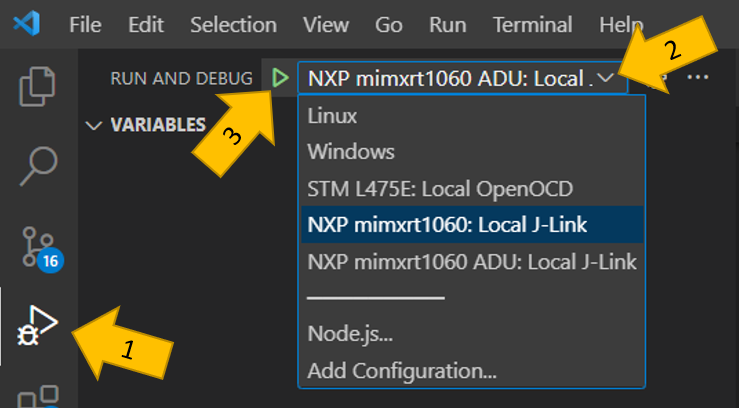
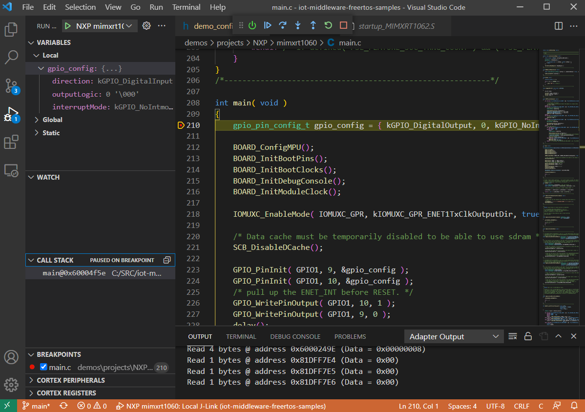

# Debug an NXP MIMXRT1060-EVK Evaluation kit using VS Code

## Before you start

In order to debug the MIMXRT1060-EVK with Visual Studio Code, this guide requires Segger J-Link. While it works, currently this  experimental and [not suported scenario](https://forum.segger.com/index.php/Thread/8140-SOLVED-CMSIS-DAP-support-seems-to-be-disabled/?postID=29869) for Segger, so try it at your own risk.  

## What you need

* Successfully build the sample for the NXP Evaluation Kit DevKit: [MIMXRT1060-EVK](https://www.nxp.com/design/development-boards/i-mx-evaluation-and-development-boards/mimxrt1060-evk-i-mx-rt1060-evaluation-kit:MIMXRT1060-EVK).

* Make sure to run this git command before building and cloning:

 ```powershell
 # As **administrator** 
 git config --system core.longpaths true
```

## Prerequisites

* Install the [Cortex-Debug extension](https://marketplace.visualstudio.com/items?itemName=marus25.cortex-debug) on VS Code.



* Install OpenOCD
    * Get OpenOCD pre-built for Windows [here](https://gnutoolchains.com/arm-eabi/openocd/).
    * Don't forget to add the folder `bin/openocd.exe` to PATH.
    
* Install Segger JLink driver

    * If you don’t have it yet, get the J-Link software from Segger - V7.22b, 32bit (download from the [Segger page](https://www.segger.com/downloads/jlink/)).
    * Don't forget to add the folder `JLink_V722b` to PATH if not added during setup.

* You might need to restart VS Code so the terminal can recognize any changes to the PATH before proceeding to the next steps.

## Setup the Debugger

* **[Windows users]** The next step will require execution of Power Shell scripts to get your device setup for debugging. Normally, script execution is restricted by default. If you can't run the next step, run PowerShell as Administrator and set the execution policy:

    ```powershell
    Set-ExecutionPolicy Unrestricted
    ```

    In this case, don't forget to move the security settings back once you complete the setup:

    ```powershell
    Set-ExecutionPolicy Restricted
    ```

* On VSCode:
    * Click the menu `View/Command Pallette` (or CTRL+SHIFT+P)
    * Select `Tasks:Run Task`
    * Select `Build NXP mimxrt1060`

    The script will automatically setup your machine for debugging using the MIMXRT1060 dev kit. 

## Running the Debugger

* On VSCode:
    * Click the Run and Debug icon (or CTRL+SHIFT+D) as indicated in the illustration below by arrow #1
    * On the drop-down menu, shown in the illustration below by the arrow #2, select `NXP mimxrt1060: Local J-Link`.
    * Click Start Debugging (or F5), shown in the illustration below by the arrow #3.



* Debug session will be initialized and it should pause at the `reset_handler`. In the image below, we added a breakpoint to the `main.c` file and the execution stopped at this breakpoint, after the `reset_handler` as expected.



* Feel free to explore the [Cortex-Debug extension](https://marketplace.visualstudio.com/items?itemName=marus25.cortex-debug) and its documentation.
