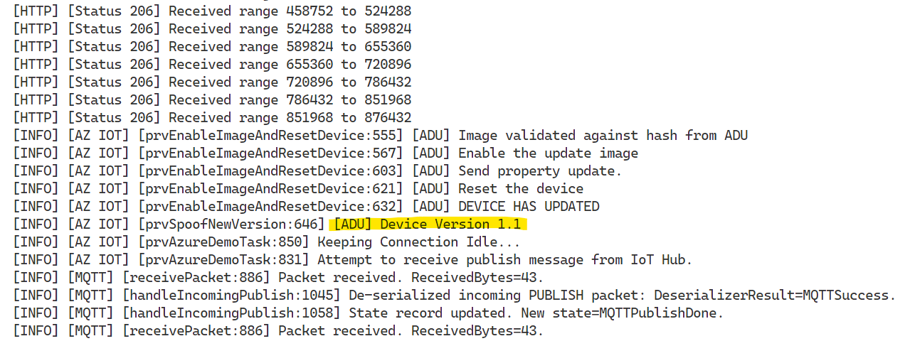

# Use Linux to simulate an over the air update using Azure IoT Middleware for FreeRTOS

This sample will allow you to run the Azure Device Update (ADU) flow, used to update devices over the air (OTA). The executable will not write the new update to the computer, only download and simulate applying it. The ADU flow is otherwise run as an updatable device would run. The following is an outline of the steps to run this sample.

- [Prerequisite Note](#prerequisite-note)
- [Get the middleware](#get-the-middleware)
- [Install Prerequisites](#install-prerequisites)
- [Prepare the simulation](#prepare-the-simulation)
  - [Set the Virtual Ethernet Interface](#set-the-virtual-ethernet-interface)
- [Build the image](#build-the-image)
- [Confirm simulated device connection details](#confirm-simulated-device-connection-details)
- [Prepare the ADU Service](#prepare-the-adu-service)
- [Deploy the Over the Air Update](#deploy-the-over-the-air-update)
  - [Build the Update Image](#build-the-update-image)
  - [Generate the ADU Update Manifest](#generate-the-adu-update-manifest)
  - [Import the Update Manifest](#import-the-update-manifest)
  - [Deploy Update](#deploy-update)

## Prerequisite Note

If using WSL to build this project, it is **HIGHLY** recommended to clone the project to the file system inside the WSL instance. Do not clone the repo to your Windows file system and open the WSL working directory to a Windows formatted directory. Clone times, build times, directory max lengths, among other problems may arise.

## Get the middleware

Clone the following repo to download all sample device code, setup scripts, and offline versions of the documentation.

**If you previously cloned this repo in another sample, you don't need to do it again.**

```bash
git clone https://github.com/Azure-Samples/iot-middleware-freertos-samples.git
```

To initialize the repo, run the following command:

```bash
cd iot-middleware-freertos-samples
git submodule update --init --recursive
```

## Install Prerequisites

* [CMake](https://cmake.org/download/) (Version 3.13 or higher)

* Azure CLI and Azure IoT Module

  See steps to install both [here](https://learn.microsoft.com/en-us/azure/iot-hub-device-update/create-update?source=recommendations#prerequisites).

* Execute the installation script for additional prerequisites:

```bash
sudo ./.github/scripts/install_software.sh
```

* Execute the Network setup script which will create virtual interfaces rtosveth0 and rtosveth1:

```bash
sudo .github/scripts/init_linux_port_vm_network.sh
```

> After running the sample, to remove any changes done by this script run it again with `--clean`.

* To run this sample you can use a device previously created in your IoT Hub or have the Azure IoT Middleware for FreeRTOS provision your device automatically using DPS.

IoT Hub | DPS
---------|----------
Have an [Azure IoT Hub](https://docs.microsoft.com/azure/iot-hub/iot-hub-create-through-portal) created | Have an instance of [IoT Hub Device Provisioning Service](https://docs.microsoft.com/azure/iot-dps/quick-setup-auto-provision#create-a-new-iot-hub-device-provisioning-service)
Have a [logical device](https://docs.microsoft.com/azure/iot-hub/iot-hub-create-through-portal#register-a-new-device-in-the-iot-hub) created in your Azure IoT Hub using your preferred authentication method* | Have an [individual enrollment](https://docs.microsoft.com/azure/iot-dps/how-to-manage-enrollments#create-a-device-enrollment) created in your instance of DPS using your preferred authentication method*

*While this sample supports SAS keys and Certificates, this guide will refer only to SAS keys.

## Prepare the simulation

To connect the simulated device to Azure, you'll modify a configuration file for Azure IoT settings, rebuild the image, and run it.

Update the file `demo_config.h` with your configuration values.

```bash
nano demos/projects/PC/linux/config/demo_config.h
```

If you're using a device previously created in your **IoT Hub** with SAS authentication, disable DPS by commenting out `#define democonfigENABLE_DPS_SAMPLE` and setting the following parameters:

Parameter | Value
---------|----------
 `democonfigDEVICE_ID` | _{Your Device ID value}_
 `democonfigHOSTNAME` | _{Your Host name value}_
 `democonfigDEVICE_SYMMETRIC_KEY` | _{Your Primary Key value}_

If you're using **DPS** with an individual enrollment with SAS authentication, set the following parameters:

Parameter | Value
---------|----------
 `democonfigID_SCOPE` | _{Your ID scope value}_
 `democonfigREGISTRATION_ID` | _{Your Device Registration ID value}_
 `democonfigDEVICE_SYMMETRIC_KEY` | _{Your Primary Key value}_

### Set the Virtual Ethernet Interface

Execute the command below to find which index you got for the `rtosveth1` (index is the number to the left of the interface). Make a note of the number for the next step.

```bash
sudo tcpdump --list-interfaces
```

Look for line #138 in `FreeRTOSConfig.h` and update `configNETWORK_INTERFACE_TO_USE` with the number you got in the previous step.

**Example**: if you got `4.rtosveth1 [Up, Running]` in the previous step, you'll update macro `configNETWORK_INTERFACE_TO_USE` to look like this `#define configNETWORK_INTERFACE_TO_USE ( 4L )`

```bash
nano demos/projects/PC/linux/config/FreeRTOSConfig.h
```

## Build the image

To build the device image, run the following commands from the root of the cloned Repo:

  ```bash
cmake -G Ninja -DVENDOR=PC -DBOARD=linux -Bbuild_linux .
cmake --build build_linux
  ```

## Confirm simulated device connection details

To monitor communication and confirm that your device is set up correctly, execute the command below.

```Bash
sudo ./build_linux/demos/projects/PC/linux/iot-middleware-sample-adu
```

## Prepare the ADU Service

To create an Azure Device Update instance and connect it to your IoT Hub, please follow the directions linked here:

- [Create an Azure Device Update Instance.](https://docs.microsoft.com/azure/iot-hub-device-update/create-device-update-account?tabs=portal)

For other prerequisite help, please see the links below. If none of the links apply to your development environment, you may skip them.

- [Create an Azure IoT Hub.](https://docs.microsoft.com/azure/iot-hub/iot-hub-create-through-portal)
  > Important: To use Azure Device Update you must have an Azure IoT Hub with [scale unit](https://learn.microsoft.com/azure/iot-hub/iot-hub-scaling) S1, S2, S3 or a free/standard hub. This sample will not work with a Basic Azure IoT Hub scale unit.
- [Create Device Provisioning Service Instance.](https://docs.microsoft.com/azure/iot-dps/quick-setup-auto-provision)

## Deploy the Over the Air Update

### Build the Update Image

Modify the version of the image as below:

On file `iot-middleware-freertos-samples\demos\projects\PC\linux\config\demo_config.h` ([found here](https://github.com/Azure-Samples/iot-middleware-freertos-samples/blob/7d9e2008a293f1786431afcc5328d39baa99dffd/demos/projects/PC/linux/config/demo_config.h#L485))

Change

```c
#define democonfigADU_UPDATE_VERSION      "1.0"
```

to

```c
#define democonfigADU_UPDATE_VERSION      "1.1"
```

The resulting executable `iot-middleware-sample-adu` should be located in the build directory in `build_linux/demos/projects/PC/linux/`. Save it into `C:\ADU-update`, renaming it to `iot-middleware-sample-adu-v1-1`.

### Generate the ADU Update Manifest

Open PowerShell.

Navigate to the `C:\ADU-update` directory (created on step 9).

Run the following command:

```powershell
az iot du update init v5 --update-provider Contoso --update-name Linux --update-version 1.1 --compat deviceModel=Linux deviceManufacturer=PC --step handler=microsoft/swupdate:1 properties='{\"installedCriteria\":\"1.1\"}' --file path=./iot-middleware-sample-adu-v1-1 > ./Contoso.Linux.1.1.importmanifest.json
```

Verify you have the following files in your ADU-update directory:

- `iot-middleware-sample-adu-v1-1`
- `Contoso.Linux.1.1.importmanifest.json`

### Import the Update Manifest

To import the update (`iot-middleware-sample-adu-v1-1`) and manifest (`Contoso.Linux.1.1.importmanifest.json`), follow the instructions at the link below:

- [Import Update and Manifest.](https://docs.microsoft.com/azure/iot-hub-device-update/import-update)

### Deploy Update

To deploy the update to your linux machine, follow the link below:

- [Deploy Update](https://docs.microsoft.com/azure/iot-hub-device-update/deploy-update)

After you deploy the update, the device should receive the new writable properties payload (i.e., the ADU service “request”) and start processing it.

After the sample finishes downloading the payload, you should see on the console, output that looks like the following:



Note the section which states `Version 1.1`. Congratulations! You were successfully able to run the Linux Azure Device Update simulator!
