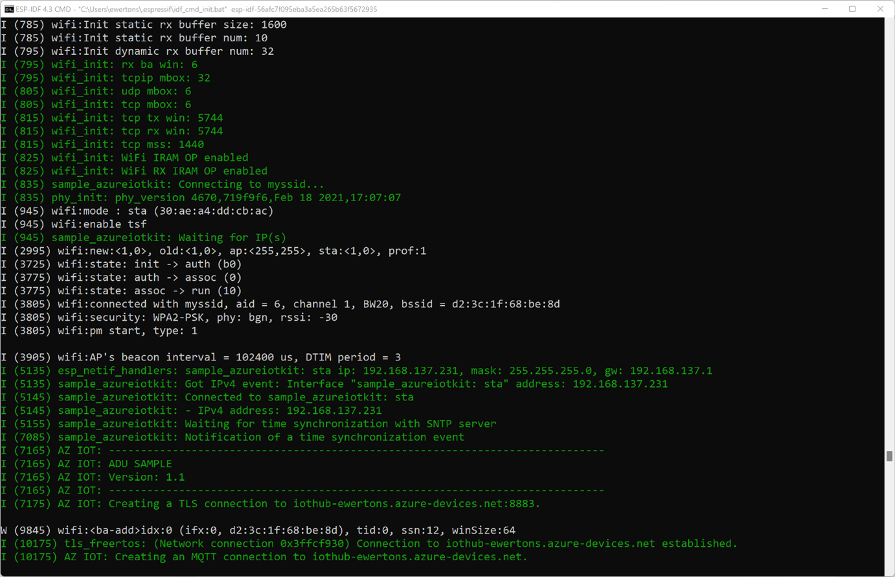

# Perform an Over the Air Update with the STMicroelectronics B-L475E-IOT01A Discovery kit

This sample will allow you to update an STMicroelectronics B-L475E-IOT01A Discovery kit over the air (OTA) using Azure Device Update. The following is an outline of the steps to run this sample.

- [Prepare the Device](#prepare-the-device)
  - [Install Prerequisites](#install-prerequisites)
  - [Tag Your Device](#tag-your-device)
  - [Prepare the Sample](#prepare-the-sample)
  - [Build the Image](#build-the-image)
  - [Flash the Image](#flash-the-image)
  - [Confirm Device Connection Details](#confirm-device-connection-details)
- [Prepare the ADU Service](#prepare-the-adu-service)
- [Deploy the Over the Air Update](#deploy-the-over-the-air-update)
  - [Build the Update Image](#build-the-update-image)
  - [Generate the ADU Update Manifest](#generate-the-adu-update-manifest)
  - [Import the Update Manifest](#import-the-update-manifest)
  - [Deploy Update](#deploy-update)
- [Tips and Tricks](#tips-and-tricks)

## Prepare the Device

### Install Prerequisites

1. Git

    Install `git` following the [official website](https://git-scm.com/). 
1. [Powershell](https://docs.microsoft.com/powershell/scripting/install/installing-powershell?view=powershell-7.2)
1. [CMake](https://cmake.org/download/) (Version 3.13 or higher)
1. [Ninja build system](https://github.com/ninja-build/ninja/releases) (Version 1.10 or higher)
1. [GNU Arm Embedded Toolchain](https://developer.arm.com/tools-and-software/open-source-software/developer-tools/gnu-toolchain/gnu-rm/downloads) (Version 9 or higher)
1. Serial terminal tool like [Termite](https://www.compuphase.com/software_termite.htm), Putty, Tera Term, etc.

Ensure that cmake, ninja and the ARM toolset binaries are available in the `PATH` environment variable.

You may also need to enable long path support for both Microsoft Windows and git:

- Windows: <https://docs.microsoft.com/windows/win32/fileio/maximum-file-path-limitation?tabs=cmd#enable-long-paths-in-windows-10-version-1607-and-later>
- Git: As **administrator** run

  ```powershell
  git config --system core.longpaths true
  ```


Clone this repo to download all sample device code, setup scripts, and offline versions of the documentation.

**If you previously cloned this repo in another sample, you don't need to do it again.**

```bash
git clone https://github.com/Azure-Samples/iot-middleware-freertos-samples.git
```

To initialize the repo, run the following commands:

```bash
cd iot-middleware-freertos-samples
git checkout feature/iot-adu
git submodule update --init --recursive
```

### Tag Your Device

Add the `"ADUGroup"` tag to the device's top-level twin document. This is used to group device together, and you may choose whichever title you prefer.

```json
"tags": {
    "ADUGroup": "<your-tag-here>"
},
```

Viewing the device twin on the portal, the "tag" section should look similar to the following. Don't worry if you do or do not have a `"deviceUpdate"` section in the `"ADUGroup"` tag. ADU adds that as a default group.


### Prepare the Sample

To connect the STM DevKit to Azure, you'll modify a configuration file for Wi-Fi and Azure IoT settings, rebuild the image, and flash the image to the device.

Update the file `iot-middleware-freertos-samples/demos/projects/ST/b-l475e-iot01a/config/demo_config.h` with your configuration values.

Set the **Wi-Fi parameters** to the following values for your local environment.

Parameter | Value 
---------|----------
 `WIFI_SSID` | _{Your Wi-Fi SSID}_
 `WIFI_PASSWORD` | _{Your Wi-Fi Password}_

If you're using a device previously created in your **IoT Hub** with SAS authentication, disable DPS by commenting out `#define democonfigENABLE_DPS_SAMPLE` and setting the following parameters:

Parameter | Value 
---------|----------
 `democonfigDEVICE_ID` | _{Your Device ID value}_
 `democonfigHOSTNAME` | _{Your Azure IoT Hub Host name value}_
 `democonfigDEVICE_SYMMETRIC_KEY` | _{Your Primary Key value}_

If you're using **DPS** with an individual enrollment with SAS authentication, set the following parameters:

Parameter | Value 
---------|----------
 `democonfigID_SCOPE` | _{Your DPS ID scope value}_
 `democonfigREGISTRATION_ID` | _{Your Device Registration ID value}_
 `democonfigDEVICE_SYMMETRIC_KEY` | _{Your Primary Key value}_

### Build the Image

To build the device image, navigate to the `iot-middleware-freertos-samples` directory and run the following commands:

  ```bash
    cmake -G Ninja -DVENDOR=ST -DBOARD=b-l475e-iot01a -Bb-l475e-iot01a .
    cmake --build b-l475e-iot01a
  ```

After the build completes, confirm that a folder named `b-l475e-iot01a/` was created and it contains a file named `demo/projects/ST/b-l475e-iot01a/iot-middleware-sample-adu.bin`. 

### Flash the Image

1. Connect the Micro USB cable to the USB STLINK port on the STM DevKit, and then connect it to your computer.

1. In File Explorer, find the binary file that you created in the previous section and copy it.

1. In File Explorer, find the STM Devkit that's connected to your computer. The device appears as a drive on your system with the drive label `DIS_L4IOT`.

1. Paste the binary file into the root folder of the STM Devkit. Flashing starts automatically and completes in a few seconds.

### Confirm Device Connection Details

You can use one of the terminal applications to monitor communication and confirm that your device is set up correctly. Go to Device Manager in Windows to determine which COM port your device was assigned.

The following settings can be used to monitor serial data:

- Baud Rate: `115200`
- Data Bits: `8`
- Stop Bits: `1`
- Parity: none
- Flow Control: none

At some point after the device connects to Azure IoT Hub, look for this splash message:

```log
I (7165) AZ IOT: ------------------------------------------------------------------------------
I (7165) AZ IOT: ADU SAMPLE
I (7165) AZ IOT: Version: 1.0
I (7165) AZ IOT: ------------------------------------------------------------------------------
```

Note the `Version: 1.0` listed.

## Prepare the ADU Service

To create an Azure Device Update instance and connect it to your IoT Hub, please follow the directions linked here:

- [Create an Azure Device Update Instance](https://docs.microsoft.com/azure/iot-hub-device-update/create-device-update-account?tabs=portal)

For other prerequisite help, please see the links below. If none of the links apply to your development environment, you may skip them.

- [Create an Azure IoT Hub](https://docs.microsoft.com/azure/iot-hub/iot-hub-create-through-portal)
- [Create Device Provisioning Service Instance](https://docs.microsoft.com/azure/iot-dps/quick-setup-auto-provision)

## Deploy the Over the Air Update

### Build the Update Image

Modify the version of the image as below:

On file `iot-middleware-freertos-samples\demos\projects\ST\b-l475e-iot01a\config\demo_config.h` ([found here](https://github.com/Azure-Samples/iot-middleware-freertos-samples/blob/vaavva/stm32l475-adu-sample/demos/projects/ST/b-l475e-iot01a/config/demo_config.h#L515))

Change

```c
#define democonfigADU_UPDATE_VERSION      "1.0"
```

to

```c
#define democonfigADU_UPDATE_VERSION      "1.1"
```

The resulting binary `iot-middleware-sample-adu.bin` should be located in the build directory in `b-l475e-iot01a\demos\projects\ST\b-l475e-iot01a\`. Save it into `C:\ADU-update`, renaming it to `iot-middleware-sample-adu-v1.1.bin`.

### Generate the ADU Update Manifest

Navigate to the `C:\ADU-update` directory:

Clone the ADU toolset.

```bash
git clone https://github.com/Azure/iot-hub-device-update
```

Generate the update manifest using **powershell**.

```powershell
Set-ExecutionPolicy -ExecutionPolicy RemoteSigned -Scope Process

Import-Module .\iot-hub-device-update\tools\AduCmdlets\AduUpdate.psm1

$updateId = New-AduUpdateId -Provider "STMicroelectronics" -Name "STM32L475" -Version 1.1

$compat = New-AduUpdateCompatibility -Properties @{ deviceManufacturer = 'STMicroelectronics'; deviceModel = 'STM32L475' }

$installStep = New-AduInstallationStep -Handler 'microsoft/swupdate:1'-HandlerProperties @{ installedCriteria = "${updateId.version}" } -Files C:\ADU-update\iot-middleware-sample-adu-v${updateId.version}.bin

$update = New-AduImportManifest -UpdateId $updateId -Compatibility $compat -InstallationSteps $installStep

$update | Out-File "./$($updateId.provider).$($updateId.name).$($updateId.version).importmanifest.json" -Encoding utf8
```

Verify you have the following files in your ADU-update directory:

- `iot-middleware-sample-adu-v1.1.bin`
- `STMicroelectronics.STM32L475.1.1.importmanifest.json`

### Import the Update Manifest

To import the update (`iot-middleware-sample-adu-v1.1.bin`) and manifest (`STMicroelectronics.STM32L475.1.1.importmanifest.json`), follow the instructions at the link below:

- [Import Update and Manifest](https://docs.microsoft.com/azure/iot-hub-device-update/import-update)

### Deploy Update

To deploy the update to your STML475, follow the link below:

- [Deploy Update](https://docs.microsoft.com/azure/iot-hub-device-update/deploy-update)

After you deploy the update, the device should receive the new writable properties payload (i.e., the ADU service “request”) and start processing it.

Once the device reboots, you should see on the console, output that looks like the following:



Note the section which states `Version 1.1`. Congratulations! Your STML475 is now running new, updated software!


## Tips and Tricks
- The [ST-Link Utility](https://www.st.com/en/development-tools/stsw-link004.html) is very helpful for developing with the flash bank. You can read flash memory, erase banks, and set the boot bank with BFB2 in the Option Bytes. This can be helpful if you've received one update from ADU and want to flash new code over USB, but the board is set to boot from Bank 2 because of the update. Note that using this to read from the flash memory while you're writing will crash the device.
- You may run into read/write protection issues that prevent you from erasing if you're changing the boot bank manually while testing (with the ST-Link utility) - if this happens, you can turn the Option Byte PCROP_RDP on, set the Read Out Protection Level to 1, then set it back to 0 (which will clear the option byte), and you should be able to read/write/erase again.