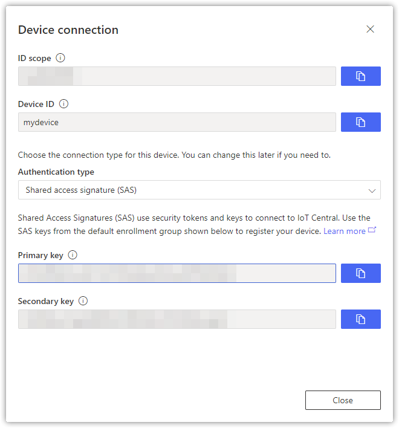
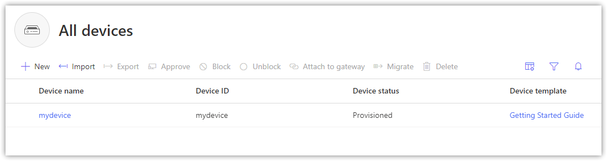
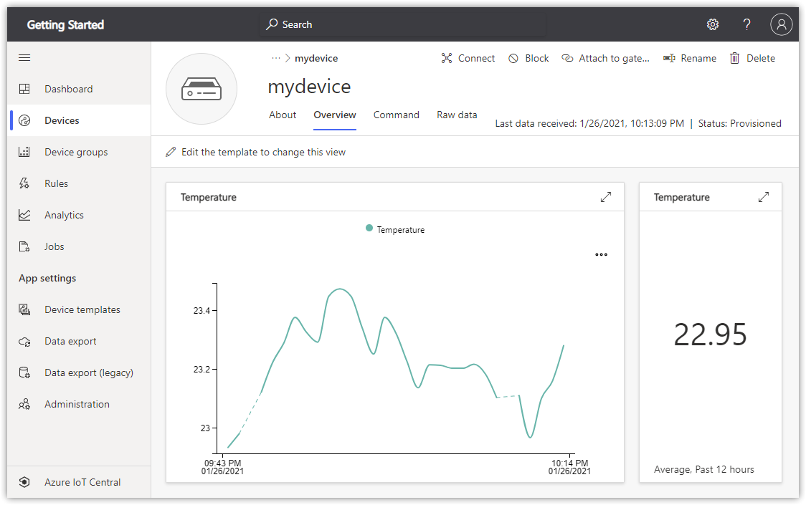
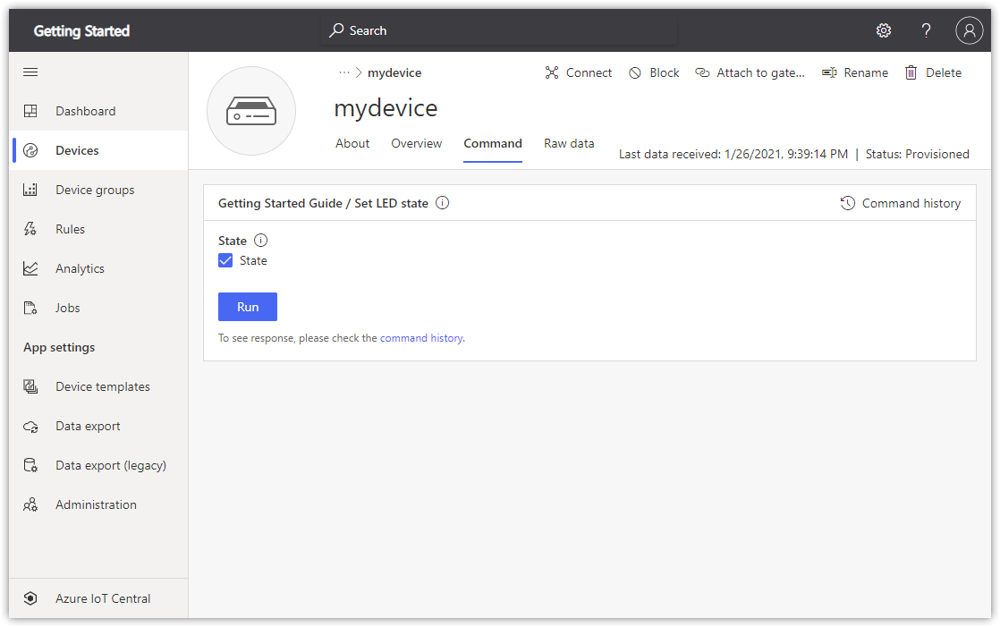
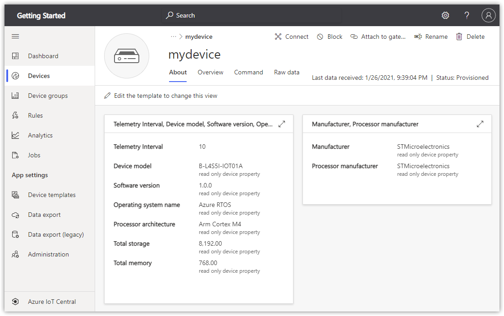

# Getting started with the STMicroelectronics B-L475E-IOT01A / B-L4S5I-IOTOA1 Discovery kits

**Total completion time**:  30 minutes

In this tutorial you use the Azure FreeRTOS Middleware to connect either the STMicroelectronics [B-L475E-IOT01A](https://www.st.com/en/evaluation-tools/b-l475e-iot01a.html) or [B-L4S5I-IOT01A](https://www.st.com/en/evaluation-tools/b-l4s5i-iot01a.html) Discovery kit (hereafter, the STM DevKit) to Azure IoT. The article is part of the series [IoT Device Development](https://go.microsoft.com/fwlink/p/?linkid=2129824). The series introduces device developers to the Azure FreeRTOS Middleware, and shows how to connect several device evaluation kits to Azure IoT.

You will complete the following tasks:

* Install a set of embedded development tools for programming the STM DevKit in C
* Build an image and flash it onto the STM DevKit
* Use Azure IoT Central to create cloud components, view properties, view device telemetry, and call direct commands

## Prerequisites

* A PC running Microsoft Windows 10
* [Git](https://git-scm.com/downloads) for cloning the repository
* Hardware

    > * STM [B-L475E-IOT01A](https://www.st.com/en/evaluation-tools/b-l475e-iot01a.html) devkit
    > * Wi-Fi 2.4 GHz
    > * USB 2.0 A male to Micro USB male cable

## Prepare the development environment

To set up your development environment, first you clone a GitHub repo that contains all the assets you need for the tutorial. Then you install a set of programming tools.

### Clone the repo for the tutorial

Clone the following repo to download all sample device code, setup scripts, and offline versions of the documentation. If you previously cloned this repo in another tutorial, you don't need to do it again.

To clone the repo, run the following command:

```shell
git clone --recursive https://github.com/Azure-Samples/iot-middleware-freertos-samples
```

### Install the tools

The cloned repo contains a setup script that installs and configures the required tools. If you installed these tools in another tutorial in the getting started guide, you don't need to do it again.

> Note: The setup script installs the following tools:
> * [CMake](https://cmake.org): Build
> * [ARM GCC](https://developer.arm.com/tools-and-software/open-source-software/developer-tools/gnu-toolchain/gnu-rm): Compile
> * [Termite](https://www.compuphase.com/software_termite.htm): Monitor serial port output for connected devices

To install the tools:

1. From File Explorer, navigate to the following path in the repo and run the setup script named *get-toolchain.bat*:

    > *iot-middleware-freertos-samples\tools\get-toolchain.bat*

1. After the installation, open a new console window to recognize the configuration changes made by the setup script. Use this console to complete the remaining programming tasks in the tutorial. You can use Windows CMD, PowerShell, or Git Bash for Windows.
1. Run the following code to confirm that CMake version **3.20** or later is installed.

    ```shell
    cmake --version
    ```

## Create the cloud components

### Create the IoT Central Application

There are several ways to connect devices to Azure IoT. In this section, you learn how to connect a device by using Azure IoT Central. IoT Central is an IoT application platform that reduces the cost and complexity of creating and managing IoT solutions.

To create a new application:
1. From [Azure IoT Central portal](https://apps.azureiotcentral.com/), select **My apps** on the side navigation menu.
1. Select **+ New application**.
1. Select **Custom apps**.
1. Add Application Name and a URL.
1. Choose the **Free** Pricing plan to activate a 7-day trial.

    

1. Select **Create**.
1. After IoT Central provisions the application, it redirects you automatically to the new application dashboard.

    > Note: If you have an existing IoT Central application, you can use it to complete the steps in this article rather than create a new application.

### Create a new device

In this section, you use the IoT Central application dashboard to create a new device. You will use the connection information for the newly created device to securely connect your physical device in a later section.

To create a device:
1. From the application dashboard, select **Devices** on the side navigation menu.
1. Select **+ New** to bring up the **Create a new device** window.
1. Leave Device template as **Unassigned**.
1. Fill in the desired Device name and Device ID.

    

1. Select the **Create** button.
1. The newly created device will appear in the **All devices** list.  Select on the device name to show details.
1. Select **Connect** in the top right menu bar to display the connection information used to configure the device in the next section.

    

1. Note the connection values for the following connection string parameters displayed in **Connect** dialog. You'll add these values to a configuration file in the next step:

> * `ID scope`
> * `Device ID`
> * `Primary key`

## Prepare the device

To connect the STM DevKit to Azure, you'll modify a configuration file for Wi-Fi and Azure IoT settings, rebuild the image, and flash the image to the device.

### Add configuration

1. Open the following file in a text editor:

    > *iot-middleware-freertos-samples/demos/projects/ST/b-l475e-iot01a/config/demo_config.h*

1. Set the Wi-Fi constants to the following values from your local environment.
    |Constant name|Value|
    |-------------|-----|
    |`WIFI_SSID` |{*Your Wi-Fi ssid*}|
    |`WIFI_PASSWORD` |{*Your Wi-Fi password*}|
    |`WIFI_SECURITY_TYPE` |{*One of the enumerated Wi-Fi mode values in the file*}|

1. Set the Azure IoT device information constants to the values that you saved after you created Azure resources.

    |Constant name|Value|
    |-------------|-----|
    |`democonfigID_SCOPE` |{*Your ID scope value*}|
    |`democonfigREGISTRATION_ID` |{*Your Device ID value*}|
    |`democonfigDEVICE_SYMMETRIC_KEY` |{*Your Primary key value*}|

1. Save and close the file.

### Build the image

In your console, run the following commands from the *iot-middleware-freertos-samples* directory to build the device image:

```shell
cmake --preset b-l475e-iot01a
cmake --build --preset b-l475e-iot01a
```

After the build completes, confirm that the binary file was created in the following path:

> *iot-middleware-freertos-samples\b-l475e-iot01a\demos\projects\ST\b-l475e-iot01a\iot-middleware-sample-gsg.bin*

### Flash the image

1. On the STM DevKit MCU, locate the **Reset** button, the Micro USB port which is labeled **USB STLink**, and the board part number. You will refer to these items in the next steps. All of them are highlighted in the following picture:

    

1. Connect the Micro USB cable to the **USB STLINK** port on the STM DevKit, and then connect it to your computer.
    > Note: For detailed setup information about the STM DevKit, see the instructions on the packaging, or see [B-L475E-IOT01A Resources](https://www.st.com/en/evaluation-tools/b-l475e-iot01a.html#resource) / [B-L4S5I-IOT01A Resources](https://www.st.com/en/evaluation-tools/b-l4s5i-iot01a.html#resource).

1. In File Explorer, find the binary files that you created in the previous section.

1. Copy the binary file whose file name corresponds to the part number of the STM Devkit you are using. For example, if your board part number is **B-L475E-IOT01A1**, copy the binary file named *iot-middleware-sample-gsg.bin*.

1. In File Explorer, find the STM Devkit that's connected to your computer. The device appears as a drive on your system with the drive label **DIS_L4IOT**.

1. Paste the binary file into the root folder of the STM Devkit. Flashing starts automatically and completes in a few seconds.

    > Note: During the flashing process, a LED toggles between red and green on the STM DevKit.

### Confirm device connection details

You can use the **Termite** utility to monitor communication and confirm that your device is set up correctly.

> **Note:** If you are unable to connect Termite to your devkit, install the [ST-LINK driver](https://my.st.com/content/ccc/resource/technical/software/driver/files/stsw-link009.zip) and try again.

1. Start **Termite**.
1. Select **Settings**.
1. In the **Serial port settings** dialog, check the following settings and update if needed:
    * **Baud rate**: 115,200
    * **Port**: The port that your STM DevKit is connected to. If there are multiple port options in the dropdown, you can find the correct port to use. Open Windows **Device Manager**, and view **Ports** to identify which port to use.

    
1. Select OK.
1. Press the **Reset** button on the device. The button is black and is labeled on the device.
1. In the **Termite** console, check the following checkpoint values to confirm that the device is initialized and connected to Azure IoT.

    ```output
    TBD
    ```

    > **Important**: If the DNS client initialization fails and notifies you that the Wi-Fi firmware is out of date, you'll need to update the Wi-Fi module firmware. Download and install the [Inventek ISM 43362 Wi-Fi module firmware update](https://www.st.com/resource/en/utilities/inventek_fw_updater.zip). Then press the **Reset** button on the device to recheck your connection, and continue this tutorial.

Keep Termite open to monitor device output in the following steps.

## Verify the device status

To view the device status in IoT Central portal:
1. From the application dashboard, select **Devices** on the side navigation menu.
1. Check the **Device status** of the device is updated to **Provisioned**.
1. Check the **Device template** of the device has updated to **Getting Stared Guide**.

    

## View telemetry

With IoT Central, you can view the flow of telemetry from your device to the cloud.

To view telemetry in IoT Central portal:

1. From the application dashboard, select **Devices** on the side navigation menu.
1. Select the device from the device list.
1. View the telemetry as the device sends messages to the cloud in the **Overview** tab.

    

> Note: You can also monitor telemetry from the device by using the Termite terminal.

## Call a direct method on the device

You can also use IoT Central to call a direct method that you have implemented on your device. Direct methods have a name, and can optionally have a JSON payload, configurable connection, and method timeout. In this section, you call a method that enables you to turn an LED on or off.

To call a method in IoT Central portal:

1. Select **Command** tab from the device page.
1. Select **State** and select **Run**.  The LED light should turn on.

    
1. Unselect **State** and select **Run**. The LED light should turn off.

## View device information

You can view the device information from IoT Central.

Select **About** tab from the device page.


## Debugging

For debugging the application, see [Debugging with Visual Studio Code](../../docs/debugging.md).

## Clean up resources

If you no longer need the Azure resources created in this tutorial, you can delete them from the IoT Central portal. Optionally, if you continue to another tutorial in this Getting Started guide, you can keep the resources you've already created and reuse them.

To keep the Azure IoT Central sample application but remove only specific devices:
1. Select the **Devices** tab for your application.
1. Select the device from the device list.
1. Select **Delete**.

To remove the entire Azure IoT Central sample application and all its devices and resources:
1. Select **Administration** > **Your application**.
1. Select **Delete**.

## Next Steps

In this tutorial you built a custom image that contains Azure FreeRTOS middleware sample code, and then flashed the image to the STM DevKit device. You also used the IoT Central portal to create Azure resources, connect the STM DevKit securely to Azure, view telemetry, and send messages.

* For device developers, the suggested next step is to see the other tutorials in the series [Getting started with Azure RTOS](https://go.microsoft.com/fwlink/p/?linkid=2129824).
