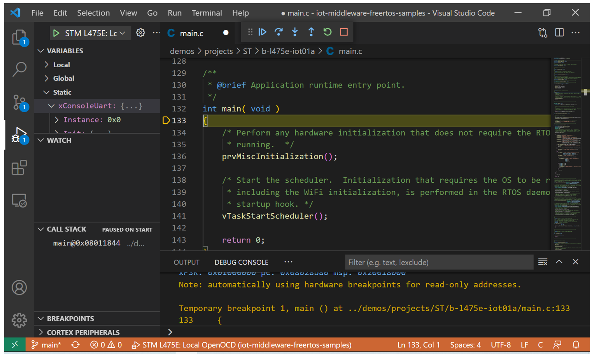

# Connect a STMicroelectronics B-L475E-IOT01A Discovery kit using Azure IoT middleware for FreeRTOS

## What you need

- ST Microelectronics DevKit: [B-L475E-IOT01A](https://www.st.com/en/evaluation-tools/b-l475e-iot01a.html)
- Wi-Fi 2.4 GHz
- Micro USB male cable

## Prerequisites

- [CMake](https://cmake.org/download/) (Version 3.13 or higher)
- [Ninja build system](https://github.com/ninja-build/ninja/releases) (Version 1.10 or higher)
- [GNU Arm Embedded Toolchain](https://developer.arm.com/tools-and-software/open-source-software/developer-tools/gnu-toolchain/gnu-rm/downloads) (This sample was tested against Version 10.3)
- Serial terminal tool like [Termite](https://www.compuphase.com/software_termite.htm), Putty, Tera Term, etc.

To run this sample you can use a device previously created on your Azure IoT Hub or you may have the Azure IoT middleware for FreeRTOS provision your device automatically using Azure Device Provisioning Services (DPS). **Note** that even when using DPS, you still need an IoT Hub created and connected to DPS.

IoT Hub | DPS
---------|----------
Have an [Azure IoT Hub](https://docs.microsoft.com/azure/iot-hub/iot-hub-create-through-portal) created | Have an instance of [IoT Hub Device Provisioning Service](https://docs.microsoft.com/azure/iot-dps/quick-setup-auto-provision#create-a-new-iot-hub-device-provisioning-service)
Have a [logical device](https://docs.microsoft.com/azure/iot-hub/iot-hub-create-through-portal#register-a-new-device-in-the-iot-hub) created in your Azure IoT Hub using your preferred authentication method* | Have an [individual enrollment](https://docs.microsoft.com/azure/iot-dps/how-to-manage-enrollments#create-a-device-enrollment) created in your instance of DPS using your preferred authentication method*

*While this sample supports SAS keys and Certificates, this guide will refer only to SAS keys.

### Install prerequisites on Windows

Ensure that cmake, ninja and the ARM toolset binaries are available in the `PATH` environment variable.

You may also need to enable long path support for both Windows and git:

- Windows: <https://docs.microsoft.com/windows/win32/fileio/maximum-file-path-limitation?tabs=cmd#enable-long-paths-in-windows-10-version-1607-and-later>
- Git: As **administrator** run

  ```powershell
  git config --system core.longpaths true
  ```

## Get the middleware

Clone the following repo to download all sample device code, setup scripts, and offline versions of the documentation. 

*If you previously cloned this repo in another sample, you don't need to do it again.*

```bash
git clone https://github.com/Azure-Samples/iot-middleware-freertos-samples.git
```

To initialize the repo, run the following command:

```bash
git submodule update --init --recursive
```

## Prepare the device

To connect the STM DevKit to Azure, you'll modify a configuration file for Wi-Fi and Azure IoT settings, rebuild the image, and flash the image to the device.

Update the file `iot-middleware-freertos-samples/demos/projects/ST/b-l475e-iot01a/config/demo_config.h` with your configuration values.

Set the **Wi-Fi parameters** to the following values for your local environment.

Parameter | Value 
---------|----------
 `WIFI_SSID` | _{Your Wi-Fi SSID}_
 `WIFI_PASSWORD` | _{Your Wi-Fi Password}_

If you're using a device previously created in your **IoT Hub** with SAS authentication, disable DPS by commenting out `#define democonfigENABLE_DPS_SAMPLE` and set the following parameters:

Parameter | Value 
---------|----------
 `democonfigDEVICE_ID` | _{Your Device ID value}_
 `democonfigHOSTNAME` | _{Your Azure IoT Hub Host name value}_
 `democonfigDEVICE_SYMMETRIC_KEY` | _{Your Primary Key value}_

If you're using **DPS** with an individual enrollment with SAS authentication, set the following parameters:

Parameter | Value 
---------|----------
 `democonfigID_SCOPE` | _{Your DPS ID scope value}_
 `democonfigREGISTRATION_ID` | _{Your Device Registration ID value}_
 `democonfigDEVICE_SYMMETRIC_KEY` | _{Your Primary Key value}_

## Build the image

To build the device image, navigate to the `iot-middleware-freertos-samples` directory and run the following commands:

  ```bash
    cmake -G Ninja -DVENDOR=ST -DBOARD=b-l475e-iot01a -Bb-l475e-iot01a .
    cmake --build b-l475e-iot01a
  ```

After the build completes, confirm that a folder named `b-l475e-iot01a/` was created and it contains a file named `demo/projects/ST/b-l475e-iot01a/iot-middleware-sample.bin`. 

## Flash the image

1. Connect the Micro USB cable to the USB STLINK port on the STM DevKit, and then connect it to your computer.

2. In File Explorer, find the binary file that you created in the previous section and copy it.

3. In File Explorer, find the STM Devkit that's connected to your computer. The device appears as a drive on your system with the drive label `DIS_L4IOT`.

4. Paste the binary file into the root folder of the STM Devkit. Flashing starts automatically and completes in a few seconds.

## Confirm device connection details

You can use one of the terminal applications to monitor communication and confirm that your device is set up correctly. Go to Device Manager in Windows to determine which COM port your device was assigned.

The following settings can be used to monitor serial data:

- Baud Rate: `115200`
- Data Bits: `8`
- Stop Bits: `1`
- Parity: none
- Flow Control: none

## VS Code debug experience for the B-L475E-IOT01A

After running the sample, you can use VS Code to debug your application directly in the Dev Kit following the steps described in [this guide](VSCodeDebug.md).



## Size Chart

The following chart shows the RAM and ROM usage for the B-L475E-IOT01A from STMicroelectronics. 
Build options: CMAKE_BUILD_TYPE=MinSizeRel (-Os) and no logging (-DLIBRARY_LOG_LEVEL=LOG_NONE):
This sample can include IoT Hub only, or IoT Hub plus DPS services and/or ADU services. The table below shows RAM/ROM sizes considering:

- Middleware libraries only – represents the libraries for Azure IoT connection.
- Total size – which includes the Azure IoT middleware for FreeRTOS, Mbed TLS, FreeRTOS, CoreMQTT and the HAL for the dev kit.

|  | Middleware library size | | Total Size | |
|---------|----------|---------|---------|---------
|**Sample** | **Flash (text,rodata)** | **RAM,RAM2(bss,data)** | **Flash (text,rodata)** | **RAM,RAM2(bss,data)** |
| IoT Hub only | 16.2 KB | 12 bytes | 201.74 KB | 104.04 KB
| IoT Hub + DPS | 31.61 KB | 12 bytes | 217.58 KB | 105.22 KB
| IoT Hub + ADU | 35.97 KB | 16 bytes | 239.07 KB | 121.29 KB
| IoT Hub + ADU + DPS | 45.02 KB | 16 bytes | 249.51 KB | 121.72 KB

<details>
  <summary>How these numbers were calculated:</summary>

  - Flash includes (based on [STM32L475VGTx_FLASH.ld](./STM32L475VGTx_FLASH.ld)):
    - .isr_vector
    - .text
    - .rodata
    - .ARM.extab
    - .ARM
    - .preinit_array
    - .init_array
    - .fini_array
  - RAM, RAM2 includes (based on [STM32L475VGTx_FLASH.ld](./STM32L475VGTx_FLASH.ld)):
    - .data
    - .bss
    - ._user_heap_stack
  - Middleware values were calculated by filtering the map file by any entries with `libaz` in the file path.
  - Total values were calculated from the map file found at the root of the build directory by summing all values within the above specified sections.
</details>