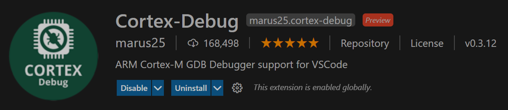
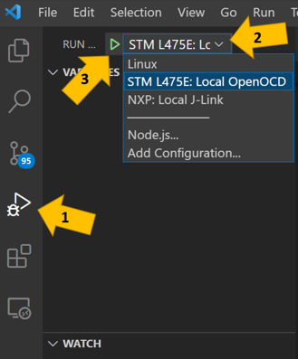

# Debug a STMicroelectronics B-L475E-IOT01A Discovery kit using VS Code

## What you need

* Have successfully run the sample for ST Microelectronics DevKit: [B-L475E-IOT01A](https://www.st.com/en/evaluation-tools/b-l475e-iot01a.html)

* Make sure you run this command on Git: As **administrator** run `git config --system core.longpaths true`

## Prerequisites

* Install the [Cortex-Debug extension](https://marketplace.visualstudio.com/items?itemName=marus25.cortex-debug) on VS Code



* Install OpenOCD
    * Get Open OCD pre-built for Windows [here](https://gnutoolchains.com/arm-eabi/openocd/).
    * Don't forget to add the folder Bin/openocd.exe to PATH
    
* Install ST Link driver

    * If you don’t have it yet, update drivers for the ST link board: en.stsw-link009 (download from [ST Micro page](https://www.st.com/en/development-tools/stsw-link009.html))
    * How can I tell if I need it? Connect your STM32L475 device to the PC and open the device manager. You should be able to see the ST-Link Debug under USBs. 
c.	If you can’t see it, download, and update the drivers.

* [Windows users] For the next step, note that in several cases, script execution is restricted by default for security reasons. If you can't run the next step, run PowerShell as Administrator and set the execution policy:

    ```powershell
    Set-ExecutionPolicy Unrestricted
    ```

    In this case, don't forget to move the security settings back once you complete the setup:

    ```powershell
    Set-ExecutionPolicy Restricted
    ```
* It might be needed to restart VS Code so the terminal can recognie any changes to PATH before proceeding to the next steps.

## Running the Debugger

* On VSCode:
    * Click the Run and Debug icon (or CTRL+SHIFT+D) as indicated in the illustration below by arrow #1
    * On the DropDown menu, shown in the illustration below by the arrow #2, select STM475E: Local OpenOCD.
    * Click Start Debugging (or F5), shown in the illustration below by the arrow #3.



* Debug session will be initialized and it should pause at the breakpoint as expected.


* Feel free to explore the [Cortex-Debug extension](https://marketplace.visualstudio.com/items?itemName=marus25.cortex-debug) and its documentation. 