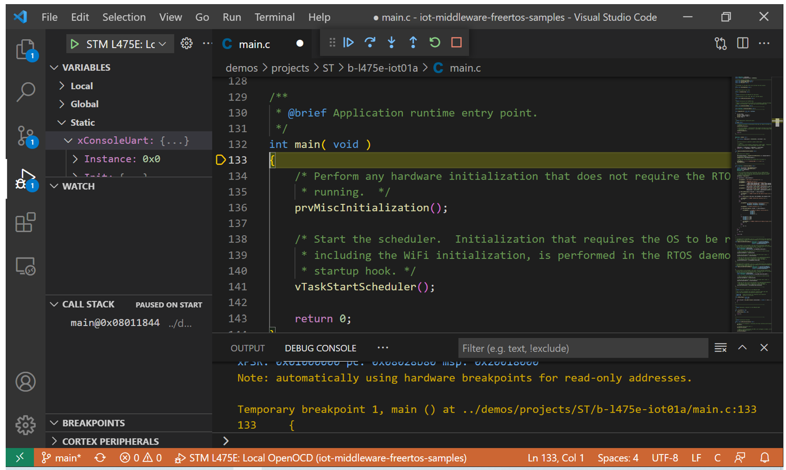

# Debug an STMicroelectronics B-L475E-IOT01A Discovery kit using VS Code

## What you need

* Successfully build the sample for the ST Microelectronics DevKit: [B-L475E-IOT01A](https://www.st.com/en/evaluation-tools/b-l475e-iot01a.html).

* Make sure to run this git command before building and cloning:

 ```powershell
 # As **administrator** 
 git config --system core.longpaths true
```

## Prerequisites

* Install the [Cortex-Debug extension](https://marketplace.visualstudio.com/items?itemName=marus25.cortex-debug) on VS Code.


* Install OpenOCD
    * Get OpenOCD pre-built for Windows [here](https://gnutoolchains.com/arm-eabi/openocd/).
    * Don't forget to add the folder `bin/openocd.exe` to PATH.
    
* Install ST Link driver

    * If you don’t have it yet, update drivers for the ST link board: en.stsw-link009 (download from the [ST Micro page](https://www.st.com/en/development-tools/stsw-link009.html)).
    * If you are unsure whether you have the updated drivers, connect your STM32L475 device to the PC and open the device manager. You should be able to see the ST-Link Debug under USBs.
    * If you can’t see it, download, and update the drivers.

* You might need to restart VS Code so the terminal can recognize any changes to the PATH before proceeding to the next steps.

## Set Up the Debugger

* [Windows users] The next step will require execution of Power Shell scripts to get your device setup for debugging. Normally, script execution is restricted by default. If you can't run the next step, run PowerShell as Administrator and set the execution policy:

    ```powershell
    Set-ExecutionPolicy Unrestricted
    ```

    In this case, don't forget to move the security settings back once you complete the setup:

    ```powershell
    Set-ExecutionPolicy Restricted
    ```

* On VSCode:
    * Click the menu `View/Command Pallette` (or CTRL+SHIFT+P)
    * Select `Tasks:Run Task`
    * Select `Build b-l475e-iot01a`

    The script will automatically set up your machine for debugging using the B-L475E-IOT01A dev kit. 

## Running the Debugger

* On VSCode:
    * Click the Run and Debug icon (or CTRL+SHIFT+D) as indicated in the illustration below by arrow #1
    * On the drop-down menu, shown in the illustration below by the arrow #2, select `STM L475E: Local OpenOCD`.
    * Click Start Debugging (or F5), shown in the illustration below by the arrow #3.


* Debug session will be initialized and it should pause at the breakpoint as expected.



* Feel free to explore the [Cortex-Debug extension](https://marketplace.visualstudio.com/items?itemName=marus25.cortex-debug) and its documentation. 
